# Sistema de Gestión de Políticas de Negocio — WorkflowSW1

> **Materia:** Ingeniería de Software 1 — Primer Parcial S1-2025  
> **Autor:** Luis Fernando Angulo  
> **Repositorio:** [github.com/luisfernandoAngulo28/Examen1SW1](https://github.com/luisfernandoAngulo28/Examen1SW1)

---

## ÍNDICE

- [1. Perfil del Proyecto](#1-perfil-del-proyecto)
  - [1.1 Introducción](#11-introducción)
  - [1.2 Objetivo General](#12-objetivo-general)
  - [1.3 Objetivos Específicos](#13-objetivos-específicos)
  - [1.4 Descripción del Problema](#14-descripción-del-problema)
  - [1.5 Alcance](#15-alcance)
- [Parte I — Fundamentación Teórica](#parte-i--fundamentación-teórica)
  - [1. Ingeniería de Software Asistido por Computadora (CASE)](#1-ingeniería-de-software-asistido-por-computadora-case)
  - [2. Desarrollo de Software Basado en Componentes](#2-desarrollo-de-software-basado-en-componentes)
  - [3. Ingeniería Humana (Experiencia del Usuario — UX)](#3-ingeniería-humana-experiencia-del-usuario--ux)
  - [4. Inteligencia Artificial Aplicada en el Desarrollo del Software](#4-inteligencia-artificial-aplicada-en-el-desarrollo-del-software)
  - [5. IA Integrada en el IDE (Entorno de Desarrollo)](#5-ia-integrada-en-el-ide-entorno-de-desarrollo)
  - [6. El Proceso de Desarrollo de Software (PUDS)](#6-el-proceso-de-desarrollo-de-software-puds)
  - [7. UML](#7-uml)
- [Parte II — Desarrollo del Proyecto](#parte-ii--desarrollo-del-proyecto)
  - [Arquitectura del Sistema](#arquitectura-del-sistema)
  - [Stack Tecnológico](#stack-tecnológico)
  - [Modelo de Datos](#modelo-de-datos)
  - [Módulos del Backend](#módulos-del-backend)
  - [Páginas del Frontend](#páginas-del-frontend)
  - [Despliegue y CI/CD](#despliegue-y-cicd)
  - [Pruebas Automatizadas](#pruebas-automatizadas)
- [Parte III — Aplicación Móvil (Flutter)](#parte-iii--aplicación-móvil-flutter)
  - [Descripción General](#descripción-general)
  - [Arquitectura de la App Móvil](#arquitectura-de-la-app-móvil)
  - [Stack Tecnológico Móvil](#stack-tecnológico-móvil)
  - [Pantallas y Flujos](#pantallas-y-flujos)
  - [Notificaciones Push FCM](#notificaciones-push-fcm)
  - [Integración con el Backend](#integración-con-el-backend)
- [Parte I — Fundamentación Teórica (Segundo Parcial)](#parte-i--fundamentación-teórica-segundo-parcial)
  - [8. Sistema de Gestión Documental](#8-sistema-de-gestión-documental)
  - [9. Deep Learning y Procesamiento de Lenguaje Natural (NLP)](#9-deep-learning-y-procesamiento-de-lenguaje-natural-nlp)
  - [10. Infraestructura en la Nube — Amazon Web Services (AWS)](#10-infraestructura-en-la-nube--amazon-web-services-aws)
- [Parte II — Proceso de Desarrollo (Ciclo 2)](#parte-ii--proceso-de-desarrollo-ciclo-2)
  - [Ciclo 2 — Segundo Parcial](#ciclo-2--segundo-parcial)
  - [Arquitectura C4 — Ciclo 2](#arquitectura-c4--ciclo-2)
  - [Diagramas UML Ciclo 2](#diagramas-uml-ciclo-2)
  - [Comparativa Ciclo 1 vs Ciclo 2](#comparativa-ciclo-1-vs-ciclo-2)
- [Anexos — Estándares de Codificación (Clean Code)](#anexos--estándares-de-codificación-clean-code)

---

## 1. PERFIL DEL PROYECTO

### 1.1 Introducción

El presente proyecto propone el desarrollo de un sistema de gestión de políticas de negocio (workflow) mediante el uso de diagramas de actividad UML organizados en calles (swimlanes), con un enfoque orientado a la automatización de trámites y procesos organizacionales. La iniciativa surge de la necesidad de contar con herramientas que no solo permitan modelar de manera visual y estructurada los flujos de una empresa, sino que también automaticen el enrutamiento de las tareas y faciliten el monitoreo en tiempo real. 

El sistema contempla un entorno de diseño visual donde los administradores pueden crear los flujos de trabajo, transformando estos diagramas en procesos ejecutables gestionados por un motor de workflow. De esta forma, se garantiza que cada tarea sea asignada al departamento correspondiente de manera automática, reduciendo tiempos de espera y minimizando errores humanos en la transición entre etapas. 

Adicionalmente, el proyecto integra características innovadoras como el diseño colaborativo en tiempo real, permitiendo a múltiples usuarios trabajar sobre la misma política de negocio. A ello se suma la incorporación de funcionalidades impulsadas por Inteligencia Artificial (IA), como la interacción mediante comandos de voz para la creación de flujos, el llenado automático de formularios (voz y OCR) para los funcionarios, y un módulo analítico capaz de detectar automáticamente cuellos de botella en la atención al cliente, ofreciendo una herramienta altamente eficiente e intuitiva.

El proyecto se desarrolló aplicando la metodología **PUDS (Proceso Unificado de Desarrollo de Software)**, utilizando herramientas CASE modernas y principios de ingeniería humana centrados en la experiencia del usuario.

### 1.2 Objetivos

#### 1.2.1 Objetivo General
Desarrollar un software web que integre el diseño visual de políticas de negocio, la ejecución automatizada de flujos de trabajo (workflow) y el monitoreo de trámites en un entorno colaborativo, asistido por Inteligencia Artificial y aplicando la metodología PUDS.

#### 1.2.2 Objetivos Específicos
• Diseñar e implementar un módulo de diseño visual colaborativo que permita crear y editar diagramas de actividad UML (organizados en calles) en tiempo real, incorporando asistencia de IA mediante comandos de texto y voz.
• Desarrollar un motor de workflow capaz de instanciar trámites a partir de los diagramas diseñados, automatizando el flujo secuencial, condicional, iterativo y paralelo entre los distintos departamentos.
• Incorporar formularios dinámicos para los funcionarios, que faciliten la carga de información mediante métodos manuales, dictado por voz (Web Speech API) y reconocimiento óptico de caracteres (OCR mediante Tesseract.js).
• Implementar un sistema de monitoreo mediante WebSocket que se actualice en tiempo real, indicando visualmente (mediante semáforos) el estado y prioridad de las actividades pendientes.
• Integrar un módulo analítico basado en Inteligencia Artificial que detecte cuellos de botella en el flujo de atención al cliente y sugiera optimizaciones en las políticas de negocio.
• Garantizar la coherencia entre el diseño de los diagramas UML y la ejecución del backend (Spring Boot), asegurando la trazabilidad de cada evento en una bitácora auditable.

### 1.3 Descripción del problema

En la actualidad, instituciones públicas y privadas que gestionan múltiples procesos de atención al cliente (como solicitudes de servicios, instalaciones de medidores o aperturas de crédito) enfrentan serios problemas de ineficiencia y falta de control. El enrutamiento de un trámite entre distintos departamentos suele realizarse de manera manual o a través de sistemas desarticulados, lo que genera estancamientos, pérdida de documentos y tiempos de espera prolongados para el usuario final.

Por otra parte, cuando el cliente requiere conocer el estado de su trámite, los funcionarios de atención al cliente carecen de una herramienta centralizada que les permita visualizar rápidamente en qué etapa y en qué departamento se encuentra la solicitud, generando insatisfacción y desinformación.

Asimismo, el diseño e implementación de nuevos flujos de trabajo dentro de la empresa suele ser un proceso rígido que requiere intervención directa de programadores. No existen suficientes herramientas accesibles que permitan a los administradores diseñar sus propias políticas de negocio de manera visual y colaborativa, y mucho menos que las conviertan inmediatamente en procesos ejecutables.

Finalmente, la falta de analítica en tiempo real impide a los gerentes identificar qué funcionario o qué departamento está demorando más de lo previsto (cuellos de botella), dificultando la toma de decisiones para optimizar el rendimiento de la organización.

### 1.4 Alcance

#### 1.4.1 Módulo de Gestión de Usuarios y Departamentos
• Permite la autenticación y registro de usuarios en el sistema mediante JWT, diferenciando entre roles (DESIGNER, OFFICER y CLIENT).
• Facilita la creación y administración (CRUD) de los distintos departamentos de la organización, a los cuales se les asignarán las actividades en los diagramas (calles/swimlanes).

#### 1.4.2 Módulo de Gestión y Diseño de Políticas (Diagramación)
• Proporciona un lienzo de trabajo interactivo (ngx-graph) para la creación de diagramas de actividad UML organizados en calles (swimlanes), definiendo tareas, responsables y flujos (secuenciales, condicionales, paralelos e iterativos).
• Ofrece colaboración en tiempo real, permitiendo a múltiples diseñadores trabajar simultáneamente sobre el mismo diagrama.
• Incorpora asistencia de IA, permitiendo al usuario crear nodos y conexiones mediante comandos de voz o texto simples (prompts).

#### 1.4.3 Módulo de Ejecución de Workflow y Formularios
• Cuenta con un motor de ejecución que toma la política de negocio diseñada y gestiona el enrutamiento automático de los trámites hacia las bandejas de los funcionarios correspondientes.
• Proporciona una bandeja de entrada en tiempo real para el funcionario, organizada mediante indicadores visuales (semáforo) para mostrar tareas nuevas, en proceso o urgentes.
• Permite al funcionario completar su tarea mediante formularios dinámicos, que soportan ingreso manual, dictado por voz y extracción de texto de imágenes (OCR).

#### 1.4.4 Módulo de Monitoreo y Analítica (IA)
• Rastrea el avance general del trámite, permitiendo a los asesores informar al cliente sobre la etapa exacta de su solicitud (o recibir notificaciones push en móvil).
• Implementa un sistema de análisis con Inteligencia Artificial que evalúa los tiempos de atención y detecta automáticamente cuellos de botella en el flujo, generando reportes y recomendaciones para la optimización del proceso.

**Limitaciones:**
- El sistema no implementa notificaciones por correo electrónico.
- La IA para detección de cuellos de botella se basa en reglas heurísticas y umbrales.
- El OCR está limitado a imágenes con texto claro en español e inglés.
- Las notificaciones push requieren configurar un proyecto Firebase y el `google-services.json` en la app móvil.

---

## 2. Parte I

### 2.1 Fundamentación Teórica 

#### 2.1.1 Ingeniería de Software Asistida por Computadora – CASE 
**2.1.1.1 Introducción**
La Ingeniería de Software Asistida por Computadora, conocida como CASE (Computer-Aided Software Engineering), se refiere al uso de herramientas tecnológicas destinadas a apoyar y automatizar las diferentes fases del ciclo de vida del software. Su propósito principal es aumentar la productividad de los equipos de desarrollo, reducir los errores y asegurar la calidad de los productos generados, proporcionando un marco estandarizado y eficiente para la gestión de proyectos de software. 

**2.1.1.2 Conceptos Fundamentales**
El funcionamiento de CASE se basa en la integración de herramientas que facilitan actividades críticas dentro del desarrollo de software. Entre los conceptos fundamentales que lo caracterizan se encuentran: 
• Automatización de tareas repetitivas, como la generación de diagramas, documentación y prototipos. 
• Uso de un repositorio central, que almacena los diferentes artefactos del proyecto (requisitos, diagramas, documentos, informes) y garantiza que los equipos trabajen sobre una fuente de información unificada. 
• Cobertura del ciclo de vida del software, ya que las herramientas CASE se aplican desde las fases de análisis y diseño hasta la implementación, pruebas y mantenimiento. 

**2.1.1.3 Clasificación de Herramientas CASE**
Las herramientas CASE se clasifican en función de la etapa del ciclo de vida del software en la que son utilizadas: 
• Herramientas Upper CASE: Análisis y diseño (ej. diagramas UML de actividad en WorkflowSW1). 
• Herramientas Lower CASE: Implementación, pruebas (ej. VS Code, JUnit 5). 
• Herramientas Integrated CASE (I-CASE): Ciclo completo (ej. GitHub Actions). 

#### 2.1.2 Ingeniería de Software basada en componentes 
**2.1.2.1 Introducción**
La ingeniería de software basada en componentes es un enfoque que busca la construcción de sistemas a partir de la integración de piezas de software reutilizables denominadas componentes. Este paradigma surge como respuesta a la necesidad de reducir la complejidad y los costos de desarrollo, promoviendo la modularidad y la reutilización en lugar de la creación de código desde cero. 

**2.1.2.2 Concepto de Componente**
Un componente de software se define como una unidad independiente que encapsula una funcionalidad específica y que interactúa con otros componentes mediante interfaces claramente establecidas. Esta independencia permite que los componentes sean utilizados en distintos sistemas sin necesidad de modificar su estructura interna, garantizando portabilidad e interoperabilidad. 

**2.1.2.3 Principios Fundamentales**
La ingeniería de software basada en componentes se apoya en diversos principios esenciales para su aplicación: 
• Reutilización de módulos existentes para disminuir tiempos de desarrollo. 
• Modularidad para dividir el sistema en partes manejables. 
• Encapsulamiento que asegura independencia y ocultamiento de la lógica interna. 
• Interoperabilidad entre distintos entornos y plataformas. 
• Evolutividad que permite sustituir o actualizar componentes sin alterar el resto del sistema. 

**2.1.2.4 Aplicaciones y Tecnologías**
La ingeniería de software basada en componentes se ha materializado en diferentes tecnologías y marcos de trabajo, entre los que destacan arquitecturas basadas en Spring (módulos inyectables) y más recientemente las arquitecturas de microservicios. Estas tecnologías representan la evolución del paradigma hacia soluciones más flexibles y distribuidas. 

#### 2.1.3 Desarrollo de Software basado en componentes 
**2.1.3.1 Introducción**
El desarrollo de software basado en componentes es un enfoque práctico que aplica los principios de la ingeniería de software orientada a componentes en la construcción de sistemas. Su propósito es ensamblar aplicaciones a partir de unidades reutilizables, reduciendo el esfuerzo de programación desde cero y garantizando mayor calidad en los productos generados. 

**2.1.3.2 Características del Desarrollo Basado en Componentes**
El proceso se caracteriza por los siguientes aspectos: 
• Selección de componentes existentes en repositorios (ej. librerías de Angular). 
• Adaptación de componentes para que encajen con los requisitos específicos del sistema. 
• Ensamblaje de componentes en una arquitectura unificada que permita la comunicación e interoperabilidad. 
• Creación de componentes nuevos únicamente cuando no existan soluciones previas reutilizables. 

**2.1.3.3 Fases del Desarrollo**
Este enfoque incorpora fases particulares que complementan las etapas tradicionales del ciclo de vida del software: 
• Análisis y especificación de requisitos, identificando qué componentes pueden satisfacerlos. 
• Búsqueda y evaluación de componentes disponibles en repositorios o marcos de trabajo. 
• Adaptación e integración de componentes en la arquitectura del sistema. 
• Pruebas de integración, orientadas a verificar la interoperabilidad y el correcto funcionamiento conjunto de los módulos. 

#### 2.1.4 Arquitectura de Software 
**2.1.4.1 Introducción**
La arquitectura de software se entiende como la estructura fundamental de un sistema, compuesta por sus componentes, sus relaciones y los principios y guías que orientan su diseño y evolución. Se trata de un nivel de abstracción superior al diseño detallado, que busca ofrecer una visión global del sistema antes de entrar en la implementación. 

**2.1.4.2 Conceptos Fundamentales**
La arquitectura de software se apoya en tres conceptos esenciales: 
• Componentes, que representan las unidades funcionales encargadas de encapsular partes del sistema. 
• Conectores, que constituyen los mecanismos de interacción entre los componentes (ej. REST API, WebSockets). 
• Atributos de Calidad (Requisitos No Funcionales): Las propiedades del sistema que definen su rendimiento. Incluyen la escalabilidad, seguridad, disponibilidad, mantenibilidad y usabilidad. 
• Reglas de Diseño: Las restricciones y principios que guían la toma de decisiones arquitectónicas.

**2.1.4.3 Importancia de una arquitectura robusta**
Una arquitectura de software bien definida es crucial por las siguientes razones: 
• Gestión de la Complejidad: Descompone un sistema complejo en partes más manejables.
• Guía para el Desarrollo: Proporciona un marco de trabajo y una visión clara.
• Toma de Decisiones Estratégicas: Permite tomar decisiones de diseño cruciales en las primeras etapas.
• Mantenibilidad y Escalabilidad: Reduce el costo de los cambios.
• Comunicación con las Partes Interesadas: Facilita la comunicación entre el equipo técnico y las partes interesadas.

**2.1.4.4 Tipos comunes de Arquitectura**
Existen diferentes estilos y patrones que se utilizan en la arquitectura de software: 
• Cliente-servidor, donde el servidor provee servicios y el cliente los consume. 
• Arquitectura orientada a servicios (SOA). 
• Microservicios, evolución de SOA que divide el sistema en servicios pequeños (ej. el backend en Spring y el microservicio de IA en FastAPI). 
• Event-driven (basada en eventos), para notificaciones asíncronas. 
• Arquitectura en Capas: El sistema se divide en capas (presentación, lógica de negocio y datos), separando responsabilidades y mejorando mantenibilidad. 

#### 2.1.5 Modelo conceptual de una Base de datos 
**2.1.5.1 Introducción**
El modelo conceptual de una base de datos constituye una representación abstracta y de alto nivel de la información que será gestionada por un sistema. Su objetivo es describir cuáles son las entidades relevantes del dominio, cómo se relacionan entre sí y qué restricciones deben cumplirse. 

**2.1.5.2 Componentes del Modelo Conceptual**
El modelo conceptual incluye los siguientes elementos: 
• Clases o Entidades, que representan los objetos de interés del dominio (ej. Políticas, Trámites, Tareas). 
• Relaciones, que indican los vínculos existentes entre las entidades (ej. referencias a ObjectIds en bases documentales). 
• Multiplicidad, que establece las restricciones de cardinalidad. 
• Restricciones, que definen condiciones adicionales que deben cumplirse. 

**2.1.5.3 Importancia del Modelo Conceptual**
El modelo conceptual cumple funciones esenciales: 
• Permite capturar los requisitos de información de manera estructurada. 
• Garantiza la coherencia y consistencia de los datos. 
• Facilita la transición hacia el modelo físico. 

#### 2.1.6 Construcción del backend mediante Spring Boot y Spring Data
**2.1.6.1 Spring Boot**
Es un framework basado en Java que simplifica el desarrollo de aplicaciones mediante una configuración mínima y una amplia integración con librerías de la plataforma Spring. Proporciona un conjunto de herramientas para construir aplicaciones listas para producción, destacando por su inyección de dependencias y capacidad para exponer servicios web a través de controladores REST. 

**2.1.6.2 Mapeo Objeto-Documento (ODM)**
Dado el uso de bases de datos NoSQL como MongoDB, se emplea un ODM en lugar de un ORM. Esto permite mapear los objetos del dominio de la aplicación directamente con colecciones y documentos BSON, eliminando la necesidad de esquemas rígidos e instrucciones SQL.

**2.1.6.3 Spring Data MongoDB**
Spring Data MongoDB proporciona el motor de persistencia que traduce operaciones sobre objetos Java en consultas nativas para MongoDB. Facilita la implementación de operaciones CRUD y la gestión de relaciones complejas (documentos embebidos o referenciados). 

**2.1.6.4 Proceso de construcción del backend con Spring Data**
Spring Boot sigue un proceso estructurado: 
• Definición de entidades: se crean clases Java anotadas con `@Document` que representan las colecciones, con atributos correspondientes a los campos. 
• Configuración de repositorios: se implementan interfaces que extienden de `MongoRepository` para operaciones CRUD automáticas. 
• Implementación de servicios: se construyen clases que encapsulan la lógica del motor de workflow. 
• Exposición de controladores REST: se crean controladores anotados con `@RestController` que definen los endpoints de la API. 

#### 2.1.7 Inteligencia Artificial aplicada a la ingeniería de software 
**2.1.7.1 Introducción**
La inteligencia artificial permite automatizar tareas complejas, optimizar procesos de desarrollo y mejorar la calidad de los productos generados. La combinación de técnicas de IA con metodologías de software permite construir sistemas más inteligentes y eficientes. 

**2.1.7.2 Aplicaciones en la Ingeniería de Software y en WorkflowSW1**
• En la asistencia y diseño: mediante algoritmos (prompts) que ayudan al administrador a dibujar el diagrama de actividades de la política de negocio. 
• En el procesamiento de lenguaje natural y visión: con herramientas de OCR (Tesseract) y dictado por voz para acelerar el llenado de formularios. 
• En el análisis: mediante módulos analíticos que detectan cuellos de botella y anomalías en los tiempos de atención de los flujos. 

#### 2.1.8 UML 
**2.1.8.1 Introducción**
El Lenguaje Unificado de Modelado (UML) es un estándar utilizado en la ingeniería de software para representar de forma visual la estructura y el comportamiento de los sistemas. 

**2.1.8.2 Diagrama de Actividades**
El corazón de WorkflowSW1 es el diagrama de actividad UML, implementado como un editor visual interactivo para diseñar los flujos de trabajo. Los elementos soportados son:
• **Nodo Inicial** (`INITIAL`) y **Nodo Final** (`FINAL`)
• **Acción** (`ACTION`): Rectángulo redondeado que representa una tarea.
• **Decisión** (`DECISION`): Rombo con condiciones lógicas para bifurcar el flujo.
• **Bifurcación (Fork)** y **Unión (Join)**: Para flujos en paralelo.
• **Calles (Swimlanes)**: Carril vertical que representa al departamento responsable.

**2.1.8.3 Diagrama de Clases (Modelo de Datos del Proyecto)**
```text
┌──────────────┐     ┌──────────────┐     ┌──────────────┐
│    User      │     │  Department  │     │   Policy     │
├──────────────┤     ├──────────────┤     ├──────────────┤
│ id           │     │ id           │     │ id           │
│ email        │◄────│ name         │     │ name         │
│ name         │     │ users[]      │────►│ status       │
│ role         │     │ nodes[]      │     │ createdBy    │
│ departmentId │     └──────────────┘     │ nodes[]      │
│ tasks[]      │                          │ edges[]      │
└──────────────┘                          │ cases[]      │
                                          └──────┬───────┘
                                                 │
                    ┌────────────────────────────┼────────────────────┐
                    ▼                            ▼                    ▼
           ┌──────────────┐            ┌──────────────┐     ┌──────────────┐
           │  PolicyNode  │            │  PolicyEdge  │     │    Case      │
           ├──────────────┤            ├──────────────┤     ├──────────────┤
           │ id           │            │ id           │     │ id           │
           │ nodeType     │◄───────────│ fromNodeId   │     │ status       │
           │ title        │◄───────────│ toNodeId     │     │ currentNodeId│
           │ posX, posY   │            │ flowType     │     │ tasks[]      │
           │ departmentId │            │ conditionLabel│    │ eventLogs[]  │
           │ formTemplate │            └──────────────┘     └──────┬───────┘
           └──────────────┘                                        │
                    │                                              ▼
                    │                                     ┌──────────────┐
                    │                                     │    Task      │
                    │                                     ├──────────────┤
                    └────────────────────────────────────►│ id           │
                                                          │ nodeId       │
                                                          │ status       │
                                                          │ assignedUser │
                                                          │ formSubmission│
                                                          └──────┬───────┘
                                                                 │
                                          ┌──────────────────────┼──────────────┐
                                          ▼                                     ▼
                                 ┌────────────────┐                   ┌──────────────┐
                                 │ FormSubmission  │                   │  EventLog    │
                                 ├────────────────┤                   ├──────────────┤
                                 │ payloadJson    │                   │ type         │
                                 │ inputMode      │                   │ payloadJson  │
                                 └────────────────┘                   │ createdAt    │
                                                                      └──────────────┘
```

#### 2.1.9 PUDS 
**2.1.9.1 Introducción**
El Proceso Unificado de Desarrollo de Software, conocido como PUDS, es una metodología iterativa e incremental que organiza el ciclo de vida del software en fases claramente definidas. Su propósito es reducir la complejidad de los proyectos, mejorar la calidad del producto final y garantizar que el sistema desarrollado cumpla con los requisitos del cliente. 

**2.1.9.2 Fases del Proceso Unificado en WorkflowSW1**
• **Inicio (Inception):** Definición del problema de gestión manual de políticas de negocio y evaluación de riesgos. 
• **Elaboración (Elaboration):** Diseño de la arquitectura cliente-servidor (Spring Boot + Angular + MongoDB) y definición de los modelos de datos. 
• **Construcción (Construction):** Desarrollo iterativo del editor visual, motor de workflow, analítica e IA. 
• **Transición (Transition):** Documentación técnica, despliegue con Docker y CI/CD. 

**2.1.9.3 Diagrama de Casos de Uso del Proyecto**
- **Actor Diseñador de Procesos (DESIGNER):** Crear políticas, diseñar diagramas UML interactivos, asignar tareas, y analizar métricas/IA.
- **Actor Funcionario (OFFICER):** Visualizar bandeja de tareas, completarlas mediante voz u OCR y tomar decisiones condicionales.

### 2.2 Herramientas Utilizadas 

#### 2.2.1 Frontend 
**2.2.1.1 Angular 18 – TypeScript**
Angular es un framework construido y mantenido por Google que proporciona funcionalidades avanzadas para aplicaciones de una sola página (SPA). Al combinarlo con TypeScript, se obtiene un entorno de desarrollo con tipado estático que facilita la detección de errores y mejora la mantenibilidad del código. Esto lo convierte en una herramienta sólida para proyectos que requieren escalabilidad y componentes reutilizables (como los formularios dinámicos y la bandeja de tareas).

**2.2.1.2 ngx-graph**
Es una librería especializada en Angular para la construcción de interfaces gráficas interactivas basadas en grafos. Permite crear diagramas y flujos de trabajo con nodos personalizables y conexiones dinámicas. Su integración con Angular es directa y eficiente, lo que la hace especialmente útil para implementar editores visuales complejos como el de diagramas de actividad UML del proyecto.

**2.2.1.3 Por qué usarlo**
La elección de Angular responde a la necesidad de contar con un framework estructurado de grado corporativo que ofrezca un conjunto amplio de herramientas integradas (como HttpClient y animaciones). `ngx-graph` se selecciona porque ofrece todas las facilidades para la creación de un lienzo interactivo con funcionalidades drag-and-drop listas para usar.

#### 2.2.2 Backend 
**2.2.2.1 Spring Boot – Java – Spring Data MongoDB**
Java ## 3. Parte II — Proceso de Desarrollo

### 3.1 Flujo de Trabajo: Captura de requisitos 

#### 3.1.1 Identificar Actores y casos de uso 
  
**Actores:** 
• Diseñador de Procesos
• Funcionario 
• Cliente
 
**A1. Diseñador de Procesos** 
Actor responsable de la creación y administración de políticas de negocio, con la capacidad de gestionar la información general, los diagramas de actividad y los departamentos asociados. 

**A2. Funcionario** 
Actor que participa en la ejecución del contenido de las políticas, con énfasis en la resolución de tareas asignadas dentro de su bandeja de entrada. 

**A3. Cliente** 
Actor externo que inicia los trámites, proporciona la información requerida (pudiendo usar comandos de voz o subir imágenes para OCR) y puede consultar el estado o la trazabilidad de sus procesos activos o finalizados.

#### 3.1.2 Casos de uso 
**CU01 Gestionar Inicio de Sesión:** Permite a los usuarios acceder al sistema mediante credenciales registradas, garantizando autenticación y seguridad. 
**CU02 Gestionar Cierre de Sesión:** Facilita que los usuarios finalicen su sesión en el sistema de manera segura, liberando recursos y protegiendo la información. 
**CU03 Gestionar Perfil de Usuario:** Permite al usuario visualizar y modificar su información personal básica asociada a su cuenta. 
**CU04 Gestionar Políticas de Negocio:** Incorpora las funciones de creación, edición, actualización y eliminación de políticas (workflows) dentro del sistema. 
**CU05 Gestionar Departamentos y Usuarios:** Permite al diseñador administrar los departamentos de la institución y asignar usuarios (funcionarios) a los mismos con sus respectivos roles. 
**CU06 Gestionar Búsqueda de Trámites:** Proporciona un mecanismo para localizar casos activos o finalizados dentro del sistema con fines de consulta. 
**CU07 Gestionar Reportes de Desempeño:** Genera reportes reflejando las métricas actuales de los diagramas y el desempeño de los trámites. 
**CU08 Gestionar Motor de Workflow:** Permite iniciar un trámite a partir de una política, enrutando automáticamente las tareas a los funcionarios correspondientes según el flujo definido. 
**CU09 Gestionar Diagrama de Actividad:** Permite crear, modificar y eliminar nodos (acciones, decisiones, bifurcaciones) y aristas dentro del lienzo interactivo. 
**CU10 Gestionar Bandeja en Tiempo Real:** Ofrece soporte a la actualización en tiempo real, permitiendo que los funcionarios vean al instante sus nuevas tareas asignadas mediante WebSockets. 
**CU11 Gestionar Llenado de Formularios mediante Comando de Voz:** Permite completar formularios dinámicos a través de instrucciones dadas por voz utilizando la Web Speech API. 
**CU12 Gestionar Extracción de Texto mediante OCR:** Facilita el llenado automático de formularios extrayendo texto a partir de imágenes o documentos escaneados usando IA. 
**CU13 Gestionar Análisis de Cuellos de Botella mediante IA:** Evalúa los tiempos de atención por nodo usando Inteligencia Artificial, identificando bloqueos en el flujo y generando recomendaciones. 
**CU14 Gestionar Toma de Decisiones Condicionales:** Permite al funcionario seleccionar un camino condicional dentro del flujo de trabajo cuando se encuentra en un nodo de tipo DECISIÓN. 
**CU15 Gestionar Trazabilidad Completa del Trámite:** Registra una bitácora inmutable (EventLogs) de todas las acciones y tiempos de cada etapa para fines de auditoría. 

#### 3.1.3 Priorización de casos de uso 

| ID | Caso de uso | Prioridad | Actores | Ciclo |
|----|-------------|-----------|---------|-------|
| CU01 | Gestionar Inicio de Sesión | Alta | A1, A2, A3 | C1 |
| CU02 | Gestionar Cierre de Sesión | Alta | A1, A2, A3 | C1 |
| CU03 | Gestionar Perfil de Usuario | Baja | A1, A2, A3 | C2 |
| CU04 | Gestionar Políticas de Negocio | Media | A1 | C1 |
| CU05 | Gestionar Departamentos y Usuarios | Media | A1 | C1 |
| CU06 | Gestionar Búsqueda de Trámites | Media | A1, A2, A3 | C1 |
| CU07 | Gestionar Reportes de Desempeño | Baja | A1 | C2 |
| CU08 | Gestionar Motor de Workflow | Alta | A1, A2, A3 | C2 |
| CU09 | Gestionar Diagrama de Actividad | Alta | A1 | C2 |
| CU10 | Gestionar Bandeja en Tiempo Real | Alta | A1, A2 | C2 |
| CU11 | Gestionar Llenado de Formularios mediante Voz | Alta | A2, A3 | C3 |
| CU12 | Gestionar Extracción de Texto mediante OCR | Alta | A2, A3 | C3 |
| CU13 | Gestionar Análisis de Cuellos de Botella mediante IA | Alta | A1 | C3 |
| CU14 | Gestionar Toma de Decisiones Condicionales | Alta | A2 | C3 |
| CU15 | Gestionar Trazabilidad Completa del Trámite | Medio | A1, A2, A3 | C3 |

**Ciclo #1** 

| ID | Caso de uso | Prioridad | Actores | Ciclo |
|----|-------------|-----------|---------|-------|
| CU01 | Gestionar Inicio de Sesión | Alta | A1, A2, A3 | C1 |
| CU02 | Gestionar Cierre de Sesión | Alta | A1, A2, A3 | C1 |
| CU04 | Gestionar Políticas de Negocio | Media | A1 | C1 |
| CU05 | Gestionar Departamentos y Usuarios | Media | A1 | C1 |
| CU06 | Gestionar Búsqueda de Trámites | Media | A1, A2, A3 | C1 |

**Ciclo #2** 

| ID | Caso de uso | Prioridad | Actores | Ciclo |
|----|-------------|-----------|---------|-------|
| CU03 | Gestionar Perfil de Usuario | Baja | A1, A2, A3 | C2 |
| CU07 | Gestionar Reportes de Desempeño | Baja | A1 | C2 |
| CU08 | Gestionar Motor de Workflow | Alta | A1, A2, A3 | C2 |
| CU09 | Gestionar Diagrama de Actividad | Alta | A1 | C2 |
| CU10 | Gestionar Bandeja en Tiempo Real | Alta | A1, A2 | C2 |

**Ciclo #3** 

| ID | Caso de uso | Prioridad | Actores | Ciclo |
|----|-------------|-----------|---------|-------|
| CU11 | Gestionar Llenado de Formularios mediante Voz | Alta | A2, A3 | C3 |
| CU12 | Gestionar Extracción de Texto mediante OCR | Alta | A2, A3 | C3 |
| CU13 | Gestionar Análisis de Cuellos de Botella mediante IA | Alta | A1 | C3 |
| CU14 | Gestionar Toma de Decisiones Condicionales | Alta | A2 | C3 |
| CU15 | Gestionar Trazabilidad Completa del Trámite | Medio | A1, A2, A3 | C3 |

#### 3.1.4 Detallar Casos de Uso 

**3.1.4.1 CU01 Gestionar Inicio de Sesión** 

| Caso de Uso | CU01 Gestionar Inicio de sesión |
|---|---|
| **Propósito** | Permitir a los usuarios acceder al sistema mediante sus credenciales registradas, garantizando autenticación y seguridad en la sesión. |
| **Actores** | Diseñador, Funcionario |
| **Iniciador** | Diseñador, Funcionario |
| **Precondición** | • El Usuario debe tener una cuenta registrada.<br>• El sistema debe estar en funcionamiento.<br>• El usuario debe tener una conexión a internet. |
| **Flujo Principal** | • El Usuario accede a la página de inicio de sesión.<br>• El sistema solicita las credenciales.<br>• El usuario ingresa sus credenciales.<br>• El sistema valida las credenciales contra la base de datos.<br>• Si son correctas, genera un token JWT e inicia sesión.<br>• El sistema habilita opciones según los permisos. |
| **Flujo Alterno** | Si las credenciales son incorrectas, muestra error. |
| **Postcondición** | • El usuario está autenticado y redirigido.<br>• Se almacena la sesión. |

**3.1.4.2 CU02 Gestionar Cierre de Sesión** 

| Caso de Uso | CU02 Gestionar Cierre de sesión |
|---|---|
| **Propósito** | Permitir finalizar la sesión de manera segura, liberando recursos. |
| **Actores** | Diseñador, Funcionario |
| **Iniciador** | Diseñador, Funcionario |
| **Precondición** | El usuario debe estar logeado. |
| **Flujo Principal** | • El usuario selecciona cerrar sesión en la interfaz.<br>• El sistema procesa el cierre invalidando el token.<br>• Redirige a la página de inicio o login.<br>• Libera recursos asociados a la sesión. |
| **Flujo Alterno** | N/A |
| **Postcondición** | El usuario es redirigido a login. |

**3.1.4.3 CU03 Gestionar Perfil de Usuario** 

| Caso de Uso | CU03 Gestionar Perfil de Usuario |
|---|---|
| **Propósito** | Visualizar y modificar información personal básica. |
| **Actores** | Diseñador, Funcionario |
| **Iniciador** | Diseñador, Funcionario |
| **Precondición** | El usuario debe estar logeado. |
| **Flujo Principal** | • El usuario accede a "Perfil de Usuario".<br>• El sistema muestra detalles (nombre, correo, rol, departamento).<br>• El usuario realiza modificaciones.<br>• El sistema valida y actualiza en la base de datos. |
| **Flujo Alterno** | Si los datos son inválidos, muestra error. |
| **Postcondición** | Cambios guardados con mensaje de éxito. |

**3.1.4.4 CU04 Gestionar Políticas de Negocio** 

| Caso de Uso | CU04 Gestionar Políticas de Negocio |
|---|---|
| **Propósito** | Crear, editar, actualizar y eliminar políticas de negocio. |
| **Actores** | Diseñador |
| **Iniciador** | Diseñador |
| **Precondición** | Usuario logeado como Diseñador. |
| **Flujo Principal** | • El usuario selecciona crear política.<br>• Ingresa nombre y descripción.<br>• El sistema valida los datos.<br>• Guarda la política en la base de datos. |
| **Flujo Alterno** | Si hay campos faltantes, impide guardar. |
| **Postcondición** | Nueva política guardada y mostrada en listado. |

**3.1.4.5 CU05 Gestionar Departamentos y Usuarios** 

| Caso de Uso | CU05 Gestionar Departamentos y Usuarios |
|---|---|
| **Propósito** | Administrar estructura organizacional (departamentos y funcionarios). |
| **Actores** | Diseñador |
| **Iniciador** | Diseñador |
| **Precondición** | Usuario logeado como Diseñador. |
| **Flujo Principal** | • Accede al módulo de administración.<br>• Selecciona agregar departamento o usuario.<br>• Confirma creación o asignación.<br>• Sistema actualiza estructura. |
| **Flujo Alterno** | N/A |
| **Postcondición** | Departamento o usuario creado exitosamente. |

**3.1.4.6 CU06 Gestionar Búsqueda de Trámites** 

| Caso de Uso | CU06 Gestionar Búsqueda de Trámites |
|---|---|
| **Propósito** | Localizar trámites activos o finalizados. |
| **Actores** | Diseñador, Funcionario |
| **Iniciador** | Diseñador, Funcionario |
| **Precondición** | Estar autenticado. |
| **Flujo Principal** | • Accede a búsqueda.<br>• Ingresa ID de trámite o estado.<br>• Sistema devuelve coincidencias.<br>• Usuario selecciona el trámite. |
| **Flujo Alterno** | Si no hay resultados, muestra mensaje vacío. |
| **Postcondición** | Usuario visualiza trazabilidad del trámite. |

**3.1.4.7 CU07 Gestionar Reportes de Desempeño** 

| Caso de Uso | CU07 Gestionar Reportes de Desempeño |
|---|---|
| **Propósito** | Generar reportes estadísticos de trámites en formato PDF o imagen. |
| **Actores** | Diseñador |
| **Iniciador** | Diseñador |
| **Precondición** | Trámites registrados en el sistema. |
| **Flujo Principal** | • Accede al Dashboard Analítico.<br>• Sistema carga gráficos.<br>• Selecciona generar reporte.<br>• Sistema exporta PDF o imagen. |
| **Flujo Alterno** | N/A |
| **Postcondición** | Reporte descargado. |

**3.1.4.8 CU08 Gestionar Motor de Workflow** 

| Caso de Uso | CU08 Gestionar Motor de Workflow |
|---|---|
| **Propósito** | Iniciar trámite a partir de política y auto-asignar tareas. |
| **Actores** | Diseñador, Funcionario |
| **Iniciador** | Diseñador |
| **Precondición** | Diagrama de actividad activado y validado. |
| **Flujo Principal** | • Selecciona iniciar trámite.<br>• Motor crea el Case.<br>• Recorre desde Nodo Inicial a primera Acción.<br>• Asigna tarea al departamento correspondiente.<br>• Si hay FORK, divide el flujo en tareas paralelas. |
| **Flujo Alterno** | Si hay error en diagrama, el motor bloquea el inicio. |
| **Postcondición** | Trámite en curso y tareas en bandejas. |

**3.1.4.9 CU09 Gestionar Diagrama de Actividad** 

| Caso de Uso | CU09 Gestionar Diagrama de Actividad |
|---|---|
| **Propósito** | Crear y modificar nodos en el lienzo interactivo. |
| **Actores** | Diseñador |
| **Iniciador** | Diseñador |
| **Precondición** | Editor de política abierto. |
| **Flujo Principal** | • Modifica nodos (acción, decisión, aristas).<br>• Confirma guardar.<br>• Sistema guarda diagrama (transacción MongoDB).<br>• Muestra mensaje de éxito. |
| **Flujo Alterno** | Si la política tiene casos activos, bloquea edición. |
| **Postcondición** | Diagrama guardado. |

**3.1.4.10 CU10 Gestionar Bandeja en Tiempo Real** 

| Caso de Uso | CU10 Gestionar Bandeja en Tiempo Real |
|---|---|
| **Propósito** | Actualizar bandeja de funcionarios vía WebSocket. |
| **Actores** | Diseñador, Funcionario |
| **Iniciador** | Sistema / Funcionario |
| **Precondición** | Conexión STOMP abierta. |
| **Flujo Principal** | • Tarea es asignada a Funcionario.<br>• Backend emite evento WS.<br>• Bandeja recibe evento instantáneo.<br>• Tarea nueva aparece resaltada. |
| **Flujo Alterno** | Si WS cae, fallback a polling HTTP. |
| **Postcondición** | Bandeja sincronizada en tiempo real. |

**3.1.4.11 CU11 Gestionar Llenado de Formularios mediante Voz** 

| Caso de Uso | CU11 Gestionar Llenado de Formularios mediante Voz |
|---|---|
| **Propósito** | Completar campos dictando texto (Web Speech API). |
| **Actores** | Funcionario |
| **Iniciador** | Funcionario |
| **Precondición** | Micrófono activado. Tarea asignada. |
| **Flujo Principal** | • Funcionario abre formulario.<br>• Selecciona micrófono en campo de texto.<br>• Dicta la información.<br>• Sistema transcribe e inyecta texto. |
| **Flujo Alterno** | Si falla reconocimiento, digita manualmente. |
| **Postcondición** | Formulario llenado por voz. |

**3.1.4.12 CU12 Gestionar Extracción de Texto mediante OCR** 

| Caso de Uso | CU12 Gestionar Extracción de Texto mediante OCR |
|---|---|
| **Propósito** | Llenado automático desde imágenes escaneadas. |
| **Actores** | Funcionario |
| **Iniciador** | Funcionario |
| **Precondición** | Tarea con soporte de carga de imagen. |
| **Flujo Principal** | • Selecciona imagen.<br>• Clic en "Escanear OCR".<br>• Sistema usa Tesseract.js para extraer texto e inyectarlo. |
| **Flujo Alterno** | Si imagen es borrosa, advierte baja calidad. |
| **Postcondición** | Datos inyectados al formulario. |

**3.1.4.13 CU13 Gestionar Análisis de Cuellos de Botella mediante IA** 

| Caso de Uso | CU13 Gestionar Análisis de Cuellos de Botella mediante IA |
|---|---|
| **Propósito** | Identificar nodos sobrecargados o lentos. |
| **Actores** | Diseñador |
| **Iniciador** | Sistema / Diseñador |
| **Precondición** | Trámites registrados con tiempos históricos. |
| **Flujo Principal** | • FastAPI evalúa tiempos de atención.<br>• Identifica excesos según umbrales.<br>• Genera alertas (Insights) sobre el cuello de botella.<br>• Diseñador visualiza recomendaciones. |
| **Flujo Alterno** | N/A |
| **Postcondición** | Recomendación visible en Dashboard. |

**3.1.4.14 CU14 Gestionar Toma de Decisiones Condicionales** 

| Caso de Uso | CU14 Gestionar Toma de Decisiones Condicionales |
|---|---|
| **Propósito** | Permitir avanzar el flujo por una rama específica tras una evaluación. |
| **Actores** | Funcionario |
| **Iniciador** | Funcionario |
| **Precondición** | Tarea asignada sobre nodo DECISIÓN. |
| **Flujo Principal** | • Funcionario abre tarea.<br>• Selecciona un camino (ej. Aprobado/Rechazado).<br>• Motor avanza solo por la rama seleccionada. |
| **Flujo Alterno** | N/A |
| **Postcondición** | Flujo bifurcado correctamente. |

**3.1.4.15 CU15 Gestionar Trazabilidad Completa del Trámite** 

| Caso de Uso | CU15 Gestionar Trazabilidad Completa del Trámite |
|---|---|
| **Propósito** | Mantener bitácora inmutable de eventos. |
| **Actores** | Diseñador, Funcionario |
| **Iniciador** | Sistema |
| **Precondición** | Trámite activo. |
| **Flujo Principal** | • Cada acción (iniciar tarea, completar formulario) dispara registro de EventLog.<br>• Guarda actor, tiempo y datos asociados.<br>• Sistema muestra línea de tiempo de sólo lectura. |
| **Flujo Alterno** | N/A |
| **Postcondición** | Trazabilidad asegurada. |

#### 3.1.5 Estructura de Modelo de Casos de uso (EMCU) 

A continuación, se presenta la organización de los casos de uso agrupados por **Ciclos de Vida** (Releases), evidenciando los límites del sistema y la interacción con los tres actores principales:

**Ciclo de vida #1 (Core & Config)**
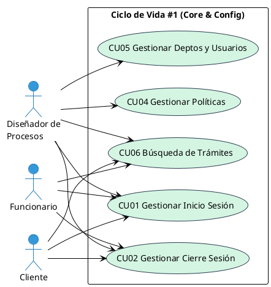

**Ciclo #2 (Engine & Real-Time)**
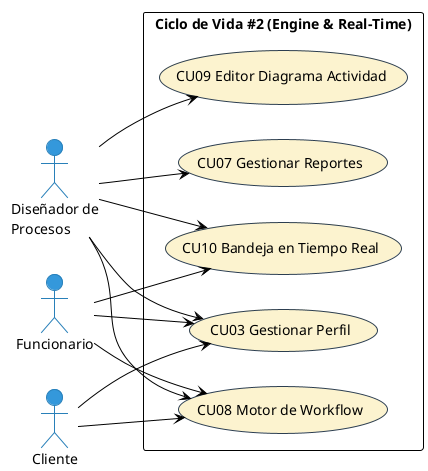

**Ciclo #3 (IA & Advanced UX)**
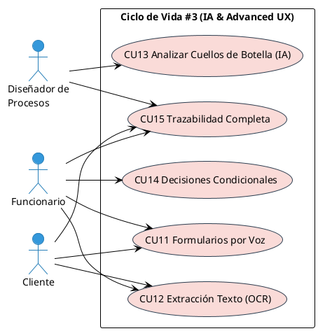


---

### 3.2 Flujo de Trabajo: Análisis

#### 3.2.1 Análisis de Arquitectura

##### 3.2.1.1 Identificar Paquetes
Para modularizar la arquitectura del sistema y organizar las responsabilidades, se han identificado tres paquetes principales:
- **Paquete de Usuario:** Gestiona todo lo relacionado con la identidad, seguridad, autenticación y la estructura organizativa (departamentos).
- **Paquete de Proyectos:** Administra el ciclo de vida central del negocio, controlando las políticas, el motor de ejecución de trámites (workflows), asignación de tareas a los funcionarios y la trazabilidad.
- **Paquete de Diagramas:** Encapsula la lógica de diseño visual (lienzo interactivo) y las herramientas avanzadas y de IA (reconocimiento de voz, OCR, análisis de cuellos de botella).

##### 3.2.1.2 Relacionar Paquete y Casos de uso

**Paquete de Gestión de Usuario**
- CU01 Gestionar Inicio de Sesión
- CU02 Gestionar Cierre de Sesión
- CU03 Gestionar Perfil de Usuario
- CU05 Gestionar Departamentos y Usuarios

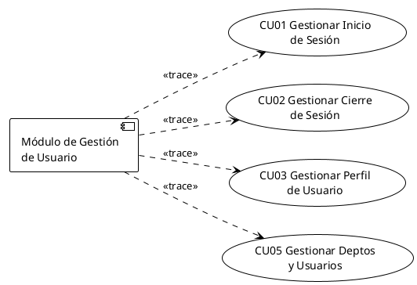

**Paquete de Gestión de Proyectos**
- CU04 Gestionar Políticas de Negocio
- CU06 Gestionar Búsqueda de Trámites
- CU07 Gestionar Reportes de Desempeño
- CU08 Gestionar Motor de Workflow
- CU10 Gestionar Bandeja en Tiempo Real
- CU14 Gestionar Toma de Decisiones Condicionales
- CU15 Gestionar Trazabilidad Completa del Trámite

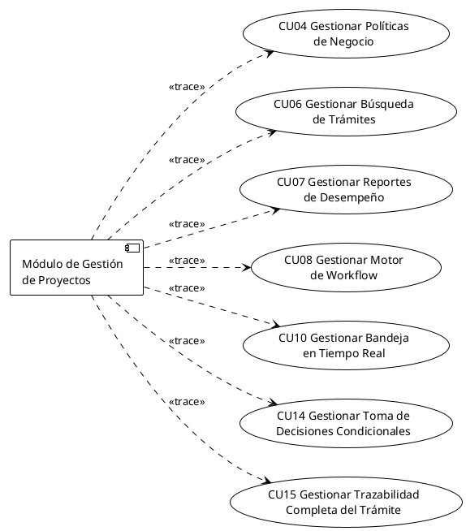

**Módulo de Gestión de Diagramas**
- CU09 Gestionar Diagrama de Actividad
- CU11 Gestionar Llenado de Formularios mediante Voz
- CU12 Gestionar Extracción de Texto mediante OCR
- CU13 Gestionar Análisis de Cuellos de Botella mediante IA

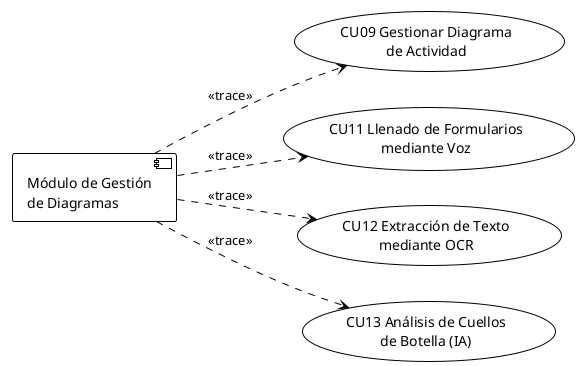

##### 3.2.1.3 Vista de Casos de uso

A continuación se detalla la vista de casos de uso para cada uno de los tres módulos principales, adaptando la herencia de actores (Diseñador, Funcionario, Cliente) que interactúan con el sistema central:

**1. Módulo de Gestión de Usuario**
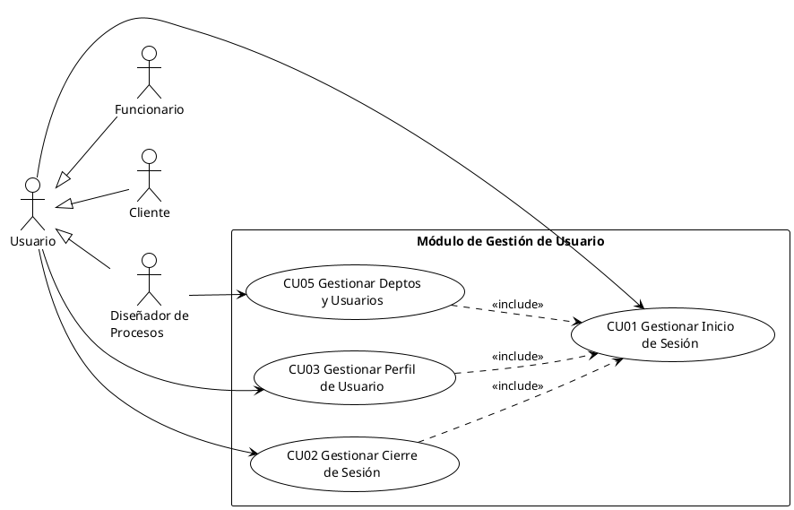

**2. Módulo de Gestión de Proyectos (Trámites/Workflows)**
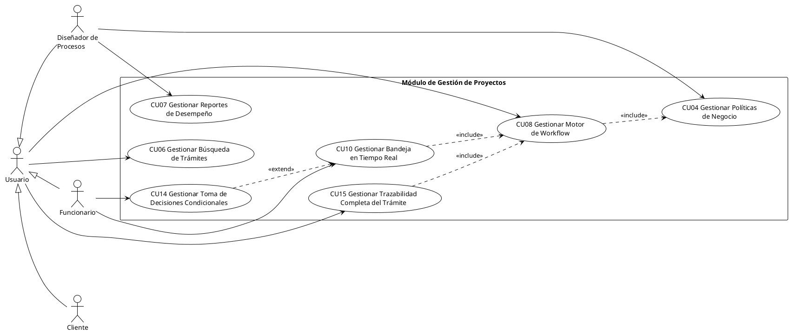

**3. Módulo de Gestión de Diagramas (Lienzo e IA)**
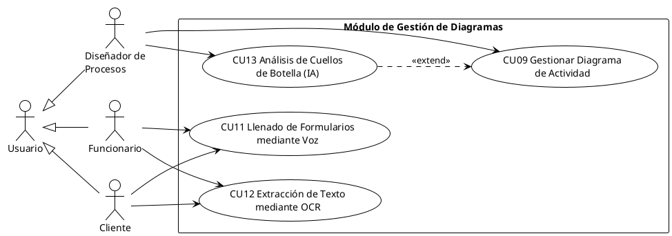

#### 3.2.2 Analizar Casos de uso ”Diagrama de Comunicación”

A continuación se presentan los diagramas de comunicación adaptados a los casos de uso principales de nuestra aplicación (Sistema de Gestión de Trámites y Workflows).

**Ciclo #1: CU04 Gestionar Políticas de Negocio**  
**Descripción:** Este caso de uso permite al Diseñador de Procesos realizar el ciclo completo de gestión de políticas (Workflows). Incluye registrar, actualizar, consultar y eliminar políticas. Al crear una política, automáticamente se genera un lienzo vacío (Diagrama) con nodos y aristas disponibles para su posterior edición.
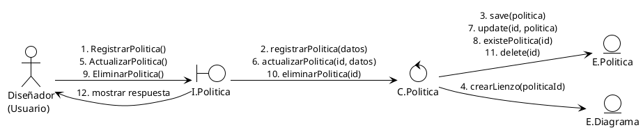

**Ciclo #2: CU09 Gestionar Diagrama de Actividad**  
**Descripción:** Permite al Diseñador manipular el diagrama de actividad asociado a una política. Puede crear, modificar o relacionar nodos (acciones, decisiones). Mediante la opción de guardar, el sistema persiste el estado actual del diagrama (transacción en MongoDB) para recuperar el lienzo en sesiones futuras.
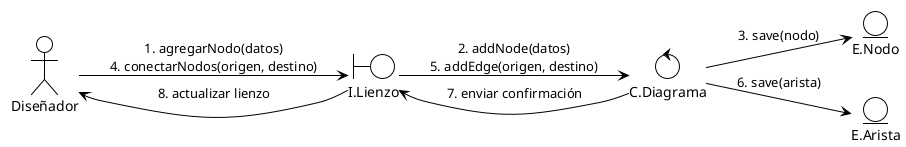

**Ciclo #2: CU08 Gestionar Motor de Workflow**  
**Descripción:** Permite iniciar un trámite a partir de una política. El Motor de Workflow lee el diagrama desde el nodo inicial, enruta automáticamente el flujo, y asigna las tareas a los funcionarios correspondientes según los departamentos definidos.
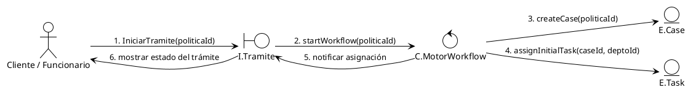

**Ciclo #3: CU11 Gestionar Llenado de Formularios mediante Voz**  
**Descripción:** Permite al funcionario completar los campos de un formulario asociado a su tarea dictando texto. El sistema captura la voz a través del micrófono, utiliza la Web Speech API para transcribirla, e inyecta la información en el formulario activo.
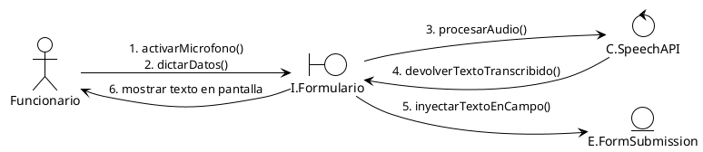

**Ciclo #3: CU15 Gestionar Trazabilidad Completa del Trámite**  
**Descripción:** Mantiene una bitácora inmutable (EventLog) de todas las acciones del trámite. Cada vez que una tarea avanza o un formulario se llena, se registra automáticamente el actor, el tiempo y el cambio de estado para fines de auditoría.
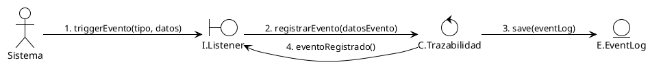

#### 3.2.3 Análisis de Clases

**Ciclo #1: CU04 Gestionar Políticas de Negocio**
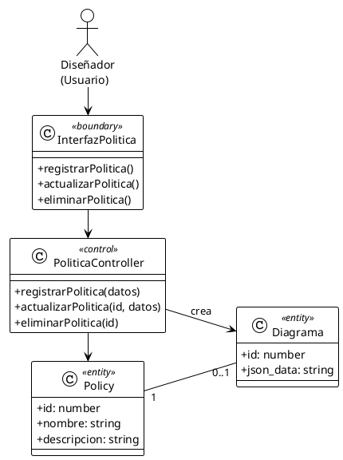

**Ciclo #2: CU09 Gestionar Diagrama de Actividad**
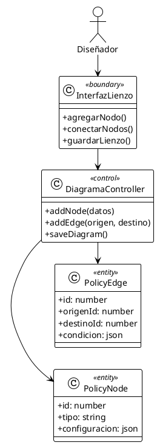

**Ciclo #2: CU08 Gestionar Motor de Workflow**
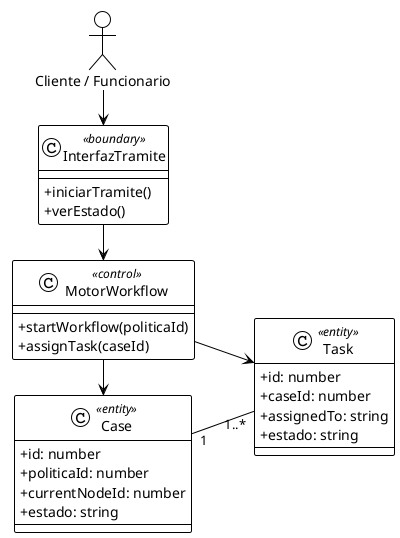

**Ciclo #3: CU11 Gestionar Llenado de Formularios mediante Voz**
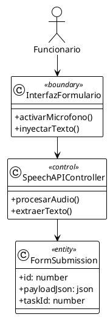

**Ciclo #3: CU15 Gestionar Trazabilidad Completa del Trámite**
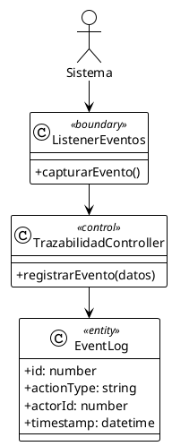

#### 3.2.4 Análisis de Paquete
*(Diagrama o análisis de paquetes)*

---

### 3.3 Flujo de Trabajo: Diseño

#### 3.3.1 Diseño de arquitectura

##### 3.3.1.1 Diseño Físico - Diagrama de Despliegue
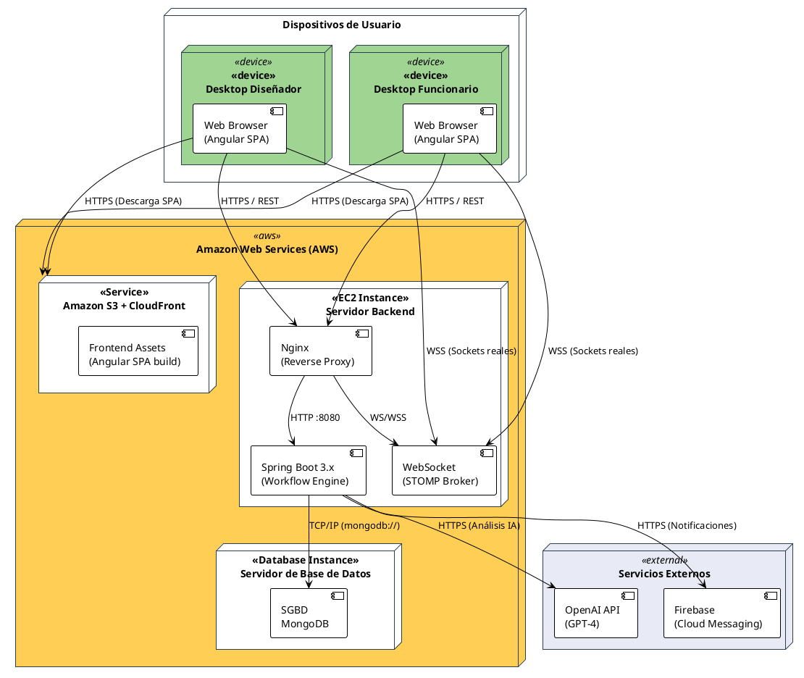

##### 3.3.1.2 Diseño Lógico – Diagrama Organizado en capas
```plantuml
@startuml Diagrama_Capas
!theme plain
skinparam packageStyle folder
skinparam packageBackgroundColor #FAD77B
skinparam packageBorderColor #2C3E50

package "Diagrama de capas" <<frame>> {
    
    package "Capa de Módulos" as Capa1 {
        package "P1: Gestión de\nusuarios" as P1
        package "P2: Gestión de\npolíticas" as P2
        package "P3: Gestión de\ntrámites" as P3
    }
    
    package "Capa Frontend" as Capa2 {
        package "App (SPA)" as FApp
        package "Services" as FServ
    }
    
    package "Capa Backend" as Capa3 {
        package "App (Backend)" as BApp
        package "Presentation" as BPres
        package "Infrastructure" as BInfra
        package "Domain" as BDom
        package "Shared" as BShared
    }
    
    package "Capa de Tecnologías" as Capa4 {
        package "App Angular" as TReact
        package "App Spring Boot" as TSpring
        package "MongoDB" as TDB
    }
    
    package "Capa de Infraestructura Cloud" as Capa5 {
        package "Amazon S3" as CFront
        package "Amazon EC2" as CBack
    }
    
    Capa1 -[hidden]down-> Capa2
    Capa2 -[hidden]down-> Capa3
    Capa3 -[hidden]down-> Capa4
    Capa4 -[hidden]down-> Capa5
}

P1 ..> FApp
P2 ..> FApp
P3 ..> FApp

FApp ..> FServ
FApp ..> BPres

BApp ..> BPres
BPres ..> BInfra
BPres ..> BDom
BPres ..> BShared

FApp ..> TReact
BApp ..> TSpring

TReact ..> TSpring
TSpring ..> TDB

TReact ..> CFront
TSpring ..> CBack
TDB ..> CBack

@enduml
```

#### 3.3.2 Diagramas de Secuencia

- **Ciclo #1: CU04 Gestionar Políticas de Negocio**
```plantuml
@startuml Sec_CU04
!theme plain
actor "Diseñador" as Actor
boundary "I.Politica" as UI
control "C.Politica" as Ctrl
entity "E.Politica" as Ent
entity "E.Diagrama" as Diag

Actor -> UI : 1. RegistrarPolitica()
activate UI
UI -> Ctrl : 2. registrarPolitica(datos)
activate Ctrl
Ctrl -> Ent : 3. save(politica)
activate Ent
Ent --> Ctrl : politica_creada
deactivate Ent
Ctrl -> Diag : 4. crearLienzo(politicaId)
activate Diag
Diag --> Ctrl : lienzo_creado
deactivate Diag
Ctrl --> UI : exito
deactivate Ctrl
UI --> Actor : 5. mostrar respuesta
deactivate UI
@enduml
```

- **Ciclo #2: CU09 Gestionar Diagrama de Actividad**
```plantuml
@startuml Sec_CU09
!theme plain
actor "Diseñador" as Actor
boundary "I.Lienzo" as UI
control "C.Diagrama" as Ctrl
entity "E.Nodo" as Nodo

Actor -> UI : 1. agregarNodo(datos)
activate UI
UI -> Ctrl : 2. addNode(datos)
activate Ctrl
Ctrl -> Nodo : 3. save(nodo)
activate Nodo
Nodo --> Ctrl : nodo_guardado
deactivate Nodo
Ctrl --> UI : confirmación
deactivate Ctrl
UI --> Actor : 4. actualizar lienzo
deactivate UI
@enduml
```

- **Ciclo #2: CU08 Gestionar Motor de Workflow**
```plantuml
@startuml Sec_CU08
!theme plain
actor "Cliente" as Actor
boundary "I.Tramite" as UI
control "C.Motor" as Ctrl
entity "E.Case" as Caso
entity "E.Task" as Tarea

Actor -> UI : 1. IniciarTramite(politicaId)
activate UI
UI -> Ctrl : 2. startWorkflow(politicaId)
activate Ctrl
Ctrl -> Caso : 3. createCase(politicaId)
activate Caso
Caso --> Ctrl : caseId
deactivate Caso
Ctrl -> Tarea : 4. assignInitialTask(caseId)
activate Tarea
Tarea --> Ctrl : tareaAsignada
deactivate Tarea
Ctrl --> UI : notificar
deactivate Ctrl
UI --> Actor : 5. mostrar estado
deactivate UI
@enduml
```

- **Ciclo #3: CU11 Gestionar Llenado de Formularios mediante Voz**
```plantuml
@startuml Sec_CU11
!theme plain
actor "Funcionario" as Actor
boundary "I.Formulario" as UI
control "C.SpeechAPI" as Ctrl
entity "E.FormSub" as Ent

Actor -> UI : 1. dictarDatos()
activate UI
UI -> Ctrl : 2. procesarAudio(blob)
activate Ctrl
Ctrl --> UI : texto_transcrito
deactivate Ctrl
UI -> Ent : 3. inyectarTextoEnCampo()
activate Ent
Ent --> UI : ok
deactivate Ent
UI --> Actor : 4. mostrar texto
deactivate UI
@enduml
```

- **Ciclo #3: CU15 Gestionar Trazabilidad Completa del Trámite**
```plantuml
@startuml Sec_CU15
!theme plain
actor "Sistema" as Actor
boundary "I.Listener" as UI
control "C.Trazabilidad" as Ctrl
entity "E.EventLog" as Ent

Actor -> UI : 1. triggerEvento(datos)
activate UI
UI -> Ctrl : 2. registrarEvento()
activate Ctrl
Ctrl -> Ent : 3. save(eventLog)
activate Ent
Ent --> Ctrl : ok
deactivate Ent
Ctrl --> UI : evento_registrado
deactivate Ctrl
@enduml
```

#### 3.3.3 Diseño de Datos

##### 3.3.3.1 Diseño Lógico
*(Diagrama lógico)*

##### 3.3.3.2 Mapeo

**Usuario**
| pk | | | | |
|---|---|---|---|---|
| id | email | username | password | profile_icon |

**Lienzo**
| pk | | fk |
|---|---|---|
| id | diagrama | proyecto_id |

**Proyecto**
| pk | | |
|---|---|---|
| id | nombre | descripcion |

**Integrante**
| pk | | fk | fk |
|---|---|---|---|
| id | rol | proyecto_id | usuario_id |

##### 3.3.3.3 Diseño Físico

**Tabla de Volumen Usuario: USUARIO**
| Atributo | Llave | Tipo de Dato | Amplitud | Nulo | Descripción |
|---|---|---|---|---|---|
| id | PK | Int | – | NO | Identificador único del usuario |
| username | Unique | VarChar | 50 | NO | Nombre de usuario (único) |
| email | Unique | String | – | NO | Correo electrónico del usuario (único) |
| password | | String | – | NO | Contraseña cifrada del usuario |
| profile_icon | | String | – | SÍ | Ruta o URL del ícono de perfil |

**Proyecto: PROYECTO**
| Atributo | Llave | Tipo de Dato | Amplitud | Nulo | Descripción |
|---|---|---|---|---|---|
| id | PK | UUID (String) | – | NO | Identificador único del proyecto |
| nombre | | String | – | NO | Nombre del proyecto |
| descripcion | | String | – | SÍ | Descripción breve del proyecto |

**Integrante: INTEGRANTE**
| Atributo | Llave | Tipo de Dato | Amplitud | Nulo | Descripción |
|---|---|---|---|---|---|
| id | PK | Int | – | NO | Identificador único del integrante |
| rol | | String | – | NO | Rol del integrante en el proyecto |
| proyecto_id | FK | UUID (String) | – | NO | Referencia al proyecto (proyectos.id) |
| usuario_id | FK | Int | – | NO | Referencia al usuario (usuarios.id) |

**Lienzo: LIENZO**
| Atributo | Llave | Tipo de Dato | Amplitud | Nulo | Descripción |
|---|---|---|---|---|---|
| id | PK | Int | – | NO | Identificador único del lienzo |
| diagrama | | JSON | – | NO | Representación del diagrama (nodos y aristas) |
| proyecto_id | FK, Unique | UUID (String) | – | NO | Referencia única al proyecto (proyectos.id) |

##### 3.3.3.4 Script
```sql
CREATE TABLE usuarios (
    id SERIAL PRIMARY KEY,
    username VARCHAR(50) UNIQUE NOT NULL,
    email VARCHAR(255) UNIQUE NOT NULL,
    password TEXT NOT NULL,
    profile_icon TEXT, 
    is_deleted BOOLEAN DEFAULT FALSE 
); 

CREATE TABLE proyectos (
    id UUID PRIMARY KEY DEFAULT gen_random_uuid(),
    nombre TEXT NOT NULL, 
    descripcion TEXT,     
    is_deleted BOOLEAN DEFAULT FALSE 
); 

CREATE TABLE integrantes (
    id SERIAL PRIMARY KEY,
    rol TEXT NOT NULL,
    proyecto_id UUID NOT NULL,
    usuario_id INT NOT NULL, 
    CONSTRAINT fk_proyecto FOREIGN KEY (proyecto_id) REFERENCES proyectos(id) ON DELETE CASCADE, 
    CONSTRAINT fk_usuario FOREIGN KEY (usuario_id) REFERENCES usuarios(id) ON DELETE CASCADE 
); 

CREATE TABLE lienzos (
    id SERIAL PRIMARY KEY,
    diagrama JSON NOT NULL,
    proyecto_id UUID UNIQUE NOT NULL, 
    CONSTRAINT fk_proyecto_lienzo FOREIGN KEY (proyecto_id) REFERENCES proyectos(id) ON DELETE CASCADE 
);
```

---

### 3.4 Flujo de Trabajo: Implementación

#### 3.4.1 Implementación de la arquitectura de sistema
*(Diagrama o detalles de implementación)*

#### 3.4.2 Implementación de la arquitectura de subsistema
- **Subsistema de Gestion de Usuario**
  #COMPLETAR 
- **Subsistema de Gestion de Proyectos**
  #COMPLETAR
- **Subsistema de Gestion de Diagramas**
  #COMPLETAR

---

### 3.5 Flujo de Trabajo: Pruebas

**PF-1: Gestionar Inicio de sesión**
- **Condición:** 
  - El Usuario debe tener una cuenta registrada en el sistema. 
  - El sistema debe estar en funcionamiento y accesible a través de una interfaz web o móvil. 
  - El usuario debe tener una conexión a internet activa. 
- **Proceso:** 
  - El usuario accede a la página de inicio de sesión. 
  - El sistema solicita las credenciales (usuario o email y contraseña). 
  - El usuario ingresa sus credenciales. 
  - El sistema valida las credenciales ingresadas contra la base de datos. 
  - Si las credenciales son correctas, el sistema inicia sesión y redirige al usuario a la página principal del sistema. 

**PF-2: Gestionar Cierre de Sesión**
- **Condición:** El usuario debe estar logeado o haber realizado el inicio de sesión previamente. 
- **Proceso:** 
  - El usuario selecciona la opción de cerrar sesión en la interfaz. 
  - El sistema procesa el cierre de sesión. 
  - El sistema finaliza la sesión del usuario y lo redirige a la página de inicio o de login. 
  - El sistema libera los recursos asociados a la sesión y protege la información del usuario. 

**PF-3: Gestionar Políticas de Negocio (CU04)**
- **Condición:**
  - El usuario debe tener el rol de "Diseñador".
  - El usuario debe haber iniciado sesión en la plataforma web.
- **Proceso:**
  - El Diseñador selecciona la opción "Crear Política de Negocio".
  - El sistema muestra el formulario para ingresar nombre y descripción.
  - El Diseñador ingresa los datos y confirma.
  - El sistema valida que los campos no estén vacíos.
  - El sistema guarda la política en la base de datos y genera automáticamente un lienzo en blanco (diagrama) asociado.
  - El sistema muestra un mensaje de éxito y redirige a la vista del lienzo.

**PF-4: Gestionar Diagrama de Actividad (CU09)**
- **Condición:**
  - El Diseñador debe estar en la vista del lienzo de una Política existente.
- **Proceso:**
  - El Diseñador arrastra un nuevo nodo (acción o decisión) al lienzo.
  - El sistema registra el nodo en la interfaz visual.
  - El Diseñador conecta dos nodos creando una arista.
  - El Diseñador presiona el botón "Guardar Diagrama".
  - El sistema procesa y valida la estructura del diagrama (nodos y aristas).
  - El sistema actualiza el JSON del diagrama en la base de datos (MongoDB).
  - El sistema muestra una notificación de "Guardado exitoso".

**PF-5: Gestionar Motor de Workflow (CU08)**
- **Condición:**
  - Debe existir al menos una Política de Negocio con un diagrama de actividad válido configurado.
  - El usuario (Cliente o Funcionario) debe haber iniciado sesión.
- **Proceso:**
  - El usuario selecciona la opción "Iniciar Trámite" eligiendo una Política específica.
  - El Motor de Workflow (backend) lee el diagrama asociado y localiza el nodo inicial.
  - El sistema crea una nueva instancia (`Case`) asociada al trámite.
  - El sistema asigna automáticamente la primera tarea (`Task`) al departamento o usuario correspondiente según el nodo inicial.
  - El sistema notifica al usuario que el trámite se ha iniciado correctamente.

**PF-6: Gestionar Llenado de Formularios mediante Voz (CU11)**
- **Condición:**
  - El Funcionario debe tener una tarea pendiente asignada.
  - El navegador debe tener permisos concedidos para usar el micrófono del dispositivo.
- **Proceso:**
  - El Funcionario abre la tarea y activa el botón de "Dictado por Voz" en un campo del formulario.
  - El Funcionario habla por el micrófono.
  - El sistema captura el audio y lo procesa mediante la API de Speech (o backend IA).
  - El servicio devuelve el texto transcrito.
  - El sistema inyecta automáticamente el texto en el campo del formulario.
  - El Funcionario visualiza el texto dictado en tiempo real.

**PF-7: Gestionar Trazabilidad Completa del Trámite (CU15)**
- **Condición:**
  - Debe existir un trámite (`Case`) en curso y el sistema debe estar configurado para escuchar eventos.
- **Proceso:**
  - Un Funcionario completa una tarea y hace clic en "Enviar" (avanza el flujo del trámite).
  - El sistema detecta el cambio de estado de la tarea y del trámite.
  - El Listener interno del sistema dispara un evento de trazabilidad.
  - El sistema registra un nuevo `EventLog` inmutable en la base de datos indicando: quién realizó la acción, qué cambió, fecha y hora.
  - Un usuario consulta el "Historial del Trámite" y el sistema muestra cronológicamente todos los pasos registrados sin posibilidad de que hayan sido alterados. 

#### 3.5.1 Tablero JIRA
*(Enlace o imagen del tablero JIRA)*

---

### 3.6 Conclusiones
- El desarrollo del **Sistema de Gestión de Trámites y Workflows** ha demostrado que es posible centralizar y automatizar políticas organizacionales complejas, logrando una ejecución secuencial e ininterrumpida de tareas bajo un motor de procesos robusto.
- La arquitectura orientada a la nube implementada sobre **Amazon Web Services (AWS)** —utilizando un frontend en Angular (S3), un backend en Spring Boot (EC2) y MongoDB— proporciona alta disponibilidad, escalabilidad y un claro desacoplamiento de responsabilidades.
- El diseño del Motor de Workflows bajo el patrón MVC (Boundary-Control-Entity) y la implementación de WebSockets lograron resolver eficazmente la sincronización en tiempo real del estado de los trámites entre Clientes, Funcionarios y el Backend.
- La integración de servicios de Inteligencia Artificial (Speech API para llenado de formularios) comprobó que la automatización del dictado por voz reduce drásticamente la fricción operativa para los funcionarios, optimizando sus tiempos de atención.
- La creación de un sistema de trazabilidad inmutable mediante registros de eventos (*EventLogs*) garantiza el cumplimiento de políticas de auditoría, brindando transparencia total sobre las acciones realizadas en cada expediente.

### 3.7 Recomendaciones
- **Auditoría Avanzada con IA:** Evaluar la implementación de un análisis de datos sobre el historial de MongoDB para identificar "cuellos de botella" frecuentes en los workflows y sugerir optimizaciones a los Diseñadores.
- **Firma Digital:** Integrar un módulo de Firma Digital Criptográfica en las tareas críticas para otorgar validez jurídica innegable a las resoluciones emitidas por los funcionarios.
- **Escalado de Infraestructura:** Migrar la orquestación actual en EC2 a un entorno de contenedores gestionados (como Amazon EKS) para permitir el autoescalado dinámico del backend durante picos masivos de trámites.
- **Aplicación Móvil:** Extender la experiencia del usuario final construyendo una versión móvil (ej. Flutter) que aproveche mejor el hardware de los teléfonos para el envío avanzado de notificaciones push en tiempo real.
- **Edición Colaborativa de Diagramas:** Dotar a la interfaz del Lienzo de funcionalidades cooperativas donde múltiples Diseñadores puedan editar una política de negocio simultáneamente viendo los cambios en tiempo real.

### 3.8 Bibliografía
- **Angular (Frontend):** https://angular.io/docs 
- **Spring Boot (Backend):** https://docs.spring.io/spring-boot/index.html 
- **Spring WebSockets (STOMP):** https://docs.spring.io/spring-framework/reference/web/websocket.html
- **MongoDB (Base de Datos):** https://www.mongodb.com/docs/ 
- **Amazon Web Services (S3, EC2):** https://aws.amazon.com/es/documentation/ 
- **OpenAI API (Inteligencia Artificial):** https://platform.openai.com/docs/ 
- **Web Speech API (Dictado por voz):** https://developer.mozilla.org/es/docs/Web/API/Web_Speech_API 
- **Firebase Cloud Messaging (Notificaciones):** https://firebase.google.com/docs/cloud-messaging 
- **PlantUML (Diagramas):** https://plantuml.com/es/ 
- **Postman (Pruebas de API):** https://www.postman.com/ 
- **Visual Studio Code:** https://code.visualstudio.com/
- **IntelliJ IDEA (Desarrollo Spring):** https://www.jetbrains.com/es-es/idea/ 
- **Metodología OMT (Rumbaugh):** https://clasesiupsm.wordpress.com/wp-content/uploads/2014/10/metodologc3ada-orientada-aobjetos-omt-james-rumbaugh.pdf 
- **Fundamentos OMT:** https://darjelingsilva.wordpress.com/wp-content/uploads/2018/05/4-metd-omt.pdf
- **Amazon EC2 — Documentación oficial:** https://docs.aws.amazon.com/es_es/ec2/
- **Amazon S3 — Documentación oficial:** https://docs.aws.amazon.com/es_es/s3/
- **AWS SDK for Java v2:** https://docs.aws.amazon.com/es_es/sdk-for-java/latest/developer-guide/home.html
- **TensorFlow 2.x — Guía oficial:** https://www.tensorflow.org/guide
- **Scikit-learn — Preprocesamiento:** https://scikit-learn.org/stable/modules/preprocessing.html
- **OpenAI API — GPT-4o-mini:** https://platform.openai.com/docs/models/gpt-4o-mini
- **ISO 15489 — Gestión Documental:** https://www.iso.org/standard/62542.html
- **C4 Model — Simon Brown:** https://c4model.com/
- **C4-PlantUML:** https://github.com/plantuml-stdlib/C4-PlantUML
- **Conventional Commits:** https://www.conventionalcommits.org/es/v1.0.0/
- **Clean Code — Robert C. Martin:** https://www.oreilly.com/library/view/clean-code-a/9780136083238/
- **Flutter — Documentación oficial:** https://docs.flutter.dev/
- **ElevenLabs API (TTS):** https://elevenlabs.io/docs 

### 3.9 ANEXOS

#### Arquitectura Spring Boot (Backend)
La arquitectura utilizada en este proyecto realizado en Java con **Spring Boot** sigue un patrón de Arquitectura Limpia (Clean Architecture) orientada al Dominio, garantizando una alta cohesión y bajo acoplamiento.
- En la capa de `controllers` (Presentación) se definen los endpoints RESTful HTTP y los manejadores de WebSockets (STOMP) que reciben y despachan las peticiones en tiempo real.
- La capa de `services` (Aplicación) orquesta el núcleo del sistema: el **Motor de Workflows**. Aquí reside la lógica principal para instanciar Casos (`Case`), asignar Tareas (`Task`), y gestionar transiciones de estado interpretando el JSON del diagrama. También centraliza la integración con APIs externas como OpenAI y Firebase.
- La capa de `domain` (Modelos) contiene las entidades puras del negocio (Políticas, Historial de Trazabilidad, Usuarios) y los DTOs encargados de estructurar la información de entrada y salida.
- La capa de `repository` (Infraestructura) emplea **Spring Data MongoDB** para la persistencia ágil de los documentos (incluyendo las complejas estructuras JSON de los diagramas), encapsulando el acceso a datos.
- En `config` se administran las políticas de seguridad (Spring Security con JWT), filtros CORS, y la configuración del Broker de mensajería (WebSocket).
- La convención de nombres sigue estrictamente el estándar oficial de Java: `camelCase` para métodos, atributos y variables, y `PascalCase` para las Clases, Interfaces y Enums.

#### Arquitectura Angular (Frontend)
La aplicación cliente, desarrollada como una Single Page Application (SPA) en **Angular** con TypeScript, está organizada de manera modular para asegurar la reutilización de código y escalabilidad.
- La estructura se divide en módulos funcionales (`NgModule`), separando áreas clave como `AuthModule` (Autenticación), `WorkflowModule` (Gestión y seguimiento de trámites), y `DiagramModule` (Editor visual interactivo de políticas).
- La carpeta `components` agrupa los elementos visuales. El componente más complejo es el "Lienzo", el cual procesa eventos avanzados de arrastrar y soltar (Drag & Drop) y renderiza la lógica de los nodos en pantalla.
- En `services` se encapsulan las llamadas HTTP hacia la API de Spring Boot. Se hace uso intensivo de **RxJS** para el manejo asíncrono y reactivo del flujo de datos, además de mantener viva la suscripción al WebSocket para actualizar el UI sin recargar la página.
- La integración de voz se aísla en un `SpeechService` personalizado que accede al micrófono vía Web Speech API y canaliza el texto transcrito directamente hacia los Formularios Reactivos (`ReactiveForms`).
- La carpeta `guards` implementa la seguridad del lado del cliente, protegiendo las rutas según el rol (Diseñador vs. Funcionario) leyendo el estado del token JWT.
- Se mantiene una fuerte consistencia de tipado gracias a TypeScript, compartiendo las mismas estructuras (Interfaces) que los DTOs definidos en el backend, evitando errores de integración.

---

## PARTE I — FUNDAMENTACIÓN TEÓRICA (SEGUNDO PARCIAL)

> Los siguientes capítulos amplían la fundamentación teórica con los nuevos temas incorporados en el Ciclo 2 del proyecto, según el alcance del segundo parcial.

---

### 8. Sistema de Gestión Documental

#### 8.1 Definición

Un **Sistema de Gestión Documental (SGD)** es una plataforma tecnológica que permite capturar, almacenar, organizar, recuperar, controlar y distribuir documentos digitales dentro de una organización. Su propósito central es eliminar el papel físico y garantizar que la información se encuentre disponible, segura, trazable y accesible para los usuarios autorizados en el momento en que la necesiten.

A diferencia de un simple gestor de archivos, un SGD incorpora lógica de negocio, control de versiones, flujos de aprobación, auditoría de accesos y políticas de retención, convirtiéndose en un componente estratégico dentro de la arquitectura de procesos de cualquier institución.

#### 8.2 Características Esenciales

| Característica | Descripción |
|----------------|-------------|
| **Captura** | Digitalización e ingesta de documentos desde escáneres, formularios web, correos o APIs externas. |
| **Almacenamiento centralizado** | Repositorio único con estructura lógica (carpetas, expedientes, categorías) y respaldo redundante. |
| **Control de versiones** | Historial de cambios por documento, con posibilidad de revertir a versiones anteriores. |
| **Control de acceso** | Permisos granulares por usuario, rol, departamento o etapa del proceso. |
| **Flujos de aprobación** | Enrutamiento automático de documentos a los responsables según reglas definidas (workflow documental). |
| **Trazabilidad y auditoría** | Registro inmutable de quién accedió, modificó o aprobó cada documento y en qué momento. |
| **Búsqueda y recuperación** | Indexación full-text y por metadatos para localizar documentos en segundos. |
| **Integración** | APIs y conectores hacia sistemas ERP, CRM, correo electrónico y otros servicios empresariales. |

#### 8.3 Aplicación en WorkflowSW1

El sistema desarrollado integra capacidades de gestión documental directamente vinculadas a cada trámite:

- **Almacenamiento en AWS S3:** Los documentos adjuntos a los trámites (formularios completados, archivos de soporte) se almacenan en el bucket `flowgov-documents` de Amazon S3, garantizando alta disponibilidad, durabilidad del 99.999999999% (11 nueves) y acceso seguro mediante credenciales IAM.
- **Asociación documento-trámite:** Cada documento está vinculado a un `Case` específico a través de la entidad `CaseDocument`, lo que permite recuperar todos los archivos de un expediente de manera inmediata.
- **Control de acceso por rol:** La entidad `DocumentAudit` registra cada operación (subida, descarga, eliminación) con el identificador del usuario, la fecha y la IP de origen, cumpliendo con principios básicos de auditoría documental.
- **Persistencia híbrida:** Los metadatos de los documentos se almacenan en MongoDB, mientras que los binarios residen en S3, separando la lógica de búsqueda del almacenamiento físico.
- **Endpoint de gestión:** `POST /api/documents/upload` permite a los funcionarios adjuntar archivos durante el procesamiento de una tarea, integrando el flujo documental con el motor de workflow.

#### 8.4 Normas y Estándares Relacionados

- **ISO 15489:** Estándar internacional para la gestión de documentos y registros.
- **MoReq2010:** Modelo de requisitos para la gestión de documentos electrónicos de archivo, ampliamente adoptado en Europa.
- **CMIS (Content Management Interoperability Services):** Estándar OASIS para la interoperabilidad entre sistemas de gestión de contenidos.

---

### 9. Deep Learning y Procesamiento de Lenguaje Natural (NLP)

#### 9.1 Deep Learning — Conceptos Aplicados

El **Deep Learning** (Aprendizaje Profundo) es una subdisciplina del Machine Learning que utiliza redes neuronales artificiales con múltiples capas ocultas para aprender representaciones jerárquicas de los datos. A diferencia del ML clásico, el Deep Learning puede aprender automáticamente las características relevantes directamente desde los datos crudos, sin necesidad de ingeniería manual de features.

En WorkflowSW1 se aplican dos vertientes del Deep Learning:

1. **Redes neuronales densas (Dense Neural Networks):** Para los modelos predictivos del ML Service (predicción de demoras, priorización de tareas).
2. **Autoencoders:** Para la detección de anomalías en flujos de trabajo, aprendiendo la representación normal de un proceso y detectando cuando un trámite se desvía significativamente de ese patrón.

#### 9.2 Procesamiento de Lenguaje Natural (NLP)

El **Procesamiento de Lenguaje Natural (NLP)** es la rama de la Inteligencia Artificial que permite a las computadoras comprender, interpretar y generar lenguaje humano (texto o voz). Sus tareas fundamentales incluyen:

| Tarea NLP | Descripción | Aplicación en el proyecto |
|-----------|-------------|--------------------------|
| **Reconocimiento de intención** | Identificar qué quiere hacer el usuario en base a su texto. | Interpreta comandos de voz en el editor de diagramas ("agregar nodo de decisión", "conectar nodo 1 con nodo 2"). |
| **Extracción de entidades** | Identificar y extraer datos concretos del texto (nombres, fechas, números). | Extrae valores de los campos del formulario a partir de la transcripción de voz del funcionario. |
| **Análisis semántico** | Comprender el significado contextual de las palabras. | Relaciona sinónimos y variaciones lingüísticas con los campos del formulario. |
| **Generación de texto** | Producir texto coherente en lenguaje natural. | Genera respuestas del asistente y síntesis de reportes. |

#### 9.3 Arquitectura NLP del AI Service

El microservicio de IA implementa un **motor NLP híbrido de dos capas**:

**Capa 1 — Motor de reglas local (siempre activo):**
- Anclaje por etiqueta de campo (detecta el nombre del campo en la transcripción).
- Sinónimos semánticos: diccionario de variaciones lingüísticas por campo.
- Patrones regex para fechas, números, documentos de identidad y montos.
- Extracción posicional basada en el orden de respuesta del usuario.
- No requiere API externa; funciona offline y sin latencia de red.

**Capa 2 — OpenAI GPT-4o-mini (cuando hay API key disponible):**
- Interpreta transcripciones ambiguas o con errores gramaticales.
- Extrae entidades con comprensión semántica profunda.
- Se usa como fallback superior cuando el motor de reglas no puede resolver un campo.

```
Transcripción de voz del funcionario
          │
          ▼
┌─────────────────────┐
│  Motor de Reglas    │ ──── ¿Resuelto? ──▶ Campo extraído
│  (regex + sinónimos)│
└─────────────────────┘
          │ No resuelto
          ▼
┌─────────────────────┐
│  OpenAI GPT-4o-mini │ ──────────────────▶ Campo extraído
│  (NLP semántico)    │
└─────────────────────┘
```

#### 9.4 TensorFlow — Modelos de Machine Learning

**TensorFlow 2.17** (framework de Google) se utiliza en el ML Service para tres modelos:

| Modelo | Arquitectura | Input | Output |
|--------|-------------|-------|--------|
| **Delay Risk Model** | Red densa: 5→16→8→1 (sigmoid) | Horas transcurridas, ratio pendientes, carga del dpto., complejidad, SLA | Probabilidad de demora [0-1] |
| **Priority Scorer** | Red densa con normalización | Urgencia, tipo de trámite, SLA, historial del cliente | Score de prioridad [0-100] |
| **Anomaly Detector** | Autoencoder: 8→4→2→4→8 | Vector de métricas del trámite | Error de reconstrucción (umbral de anomalía) |

Los modelos se entrenan automáticamente con **datos sintéticos** al iniciar el servicio, y pueden re-entrenarse con datos reales de MongoDB cuando el volumen lo justifique.

#### 9.5 Text-to-Speech (TTS)

El asistente virtual implementa síntesis de voz mediante:
- **ElevenLabs API** (primaria): Voces naturales de alta calidad en español.
- **Web Speech API** (fallback): Síntesis nativa del navegador, sin dependencia externa.

---

### 10. Infraestructura en la Nube — Amazon Web Services (AWS)

#### 10.1 Introducción a AWS

**Amazon Web Services (AWS)** es la plataforma de computación en la nube más utilizada a nivel mundial, ofrecida por Amazon desde 2006. Provee más de 200 servicios bajo demanda de infraestructura, almacenamiento, bases de datos, análisis, IA y redes, eliminando la necesidad de invertir en hardware físico propio.

Los principios clave de AWS son:
- **Escalabilidad:** Ajustar recursos según la demanda en segundos.
- **Pago por uso:** Solo se factura por los recursos efectivamente consumidos.
- **Alta disponibilidad:** Infraestructura distribuida en Zonas de Disponibilidad (AZ) y Regiones globales.
- **Seguridad:** Modelo de responsabilidad compartida, cifrado en tránsito y en reposo, IAM para control de acceso.

#### 10.2 Amazon EC2 (Elastic Compute Cloud)

**Amazon EC2** es el servicio de computación virtual de AWS. Proporciona servidores virtuales (llamados **instancias**) configurables en capacidad de CPU, RAM, almacenamiento y red.

**Características principales:**
- **Tipos de instancia:** Familias optimizadas para cómputo (C), memoria (R), propósito general (T/M), almacenamiento (I), GPU (G/P).
- **Amazon Machine Images (AMI):** Plantillas preconfiguradas con sistema operativo y software base.
- **Grupos de seguridad (Security Groups):** Firewall virtual que controla el tráfico entrante y saliente por puerto y protocolo.
- **Elastic IP:** Dirección IP pública estática asignada a la instancia.
- **Regiones y Zonas de Disponibilidad:** Las instancias se crean en una región geográfica específica (ej. `sa-east-1` = São Paulo).

**Aplicación en WorkflowSW1:**

| Parámetro | Valor |
|-----------|-------|
| Tipo de instancia | `t3.medium` (2 vCPU, 4 GB RAM) |
| Región | `sa-east-1` (São Paulo, Brasil) |
| Sistema operativo | Amazon Linux 2023 |
| IP pública | `18.231.192.169` |
| Servicios desplegados | Spring Boot (8080), Angular/Nginx (4200), FastAPI AI (8000), FastAPI ML (8001), MongoDB (27017) |
| Orquestación | Docker Compose (todos los servicios en contenedores) |

**Puertos habilitados en el Security Group:**

| Puerto | Protocolo | Servicio |
|--------|-----------|---------|
| 22 | TCP | SSH (administración) |
| 80 | TCP | HTTP |
| 443 | TCP | HTTPS |
| 8080 | TCP | Spring Boot API |
| 4200 | TCP | Frontend Angular |
| 8000 | TCP | AI Service |
| 8001 | TCP | ML Service |

#### 10.3 Amazon S3 (Simple Storage Service)

**Amazon S3** es el servicio de almacenamiento de objetos de AWS. Diseñado para guardar cualquier cantidad de datos (archivos, imágenes, vídeos, backups, logs) con durabilidad del **99.999999999%** (11 nueves) y disponibilidad del **99.99%**.

**Conceptos fundamentales:**

| Concepto | Descripción |
|----------|-------------|
| **Bucket** | Contenedor raíz de objetos. Nombre único global en toda AWS. |
| **Objeto** | Archivo almacenado, compuesto por datos + metadatos + clave (key = ruta virtual). |
| **Clave (Key)** | Identificador único del objeto dentro del bucket (actúa como ruta: `tramites/2025/doc1.pdf`). |
| **Clases de almacenamiento** | S3 Standard (acceso frecuente), S3-IA (acceso infrecuente), S3 Glacier (archivado). |
| **Control de acceso** | Bucket Policies, ACLs, IAM Roles. Puede configurarse acceso público o privado por objeto. |
| **Versionado** | Guarda múltiples versiones de un mismo objeto, permitiendo recuperar versiones anteriores. |
| **Cifrado** | SSE-S3 (clave gestionada por AWS), SSE-KMS (clave propia), SSE-C (clave del cliente). |
| **Eventos** | Notificaciones automáticas (a Lambda, SQS, SNS) cuando se sube o modifica un objeto. |

**Aplicación en WorkflowSW1:**

| Parámetro | Valor |
|-----------|-------|
| Nombre del bucket | `flowgov-documents` |
| Región | `us-east-1` (Virginia del Norte) |
| SDK utilizado | `software.amazon.awssdk:s3:2.26.12` (AWS SDK for Java v2) |
| Variables de entorno | `AWS_S3_BUCKET`, `AWS_REGION`, `AWS_ACCESS_KEY_ID`, `AWS_SECRET_ACCESS_KEY` |
| Uso | Almacenar documentos adjuntos a los trámites subidos por los funcionarios |
| Acceso | Privado — acceso solo desde el backend con credenciales IAM |

**Flujo de subida de documentos:**
```
Funcionario sube archivo (frontend)
        │
        ▼
POST /api/documents/upload (Spring Boot)
        │
        ▼
DocumentService.uploadToS3(file)
        │  AWS SDK v2
        ▼
S3Client.putObject(bucket="flowgov-documents", key="cases/{caseId}/{filename}")
        │
        ▼
URL de acceso guardada en MongoDB (CaseDocument)
```

#### 10.4 Seguridad en AWS — IAM

**IAM (Identity and Access Management)** controla quién puede hacer qué en los recursos AWS. En WorkflowSW1 se creó un usuario IAM con permisos únicamente sobre el bucket `flowgov-documents`, siguiendo el principio de **mínimo privilegio**.

---

## PARTE II — PROCESO DE DESARROLLO (CICLO 2)

### Ciclo 2 — Segundo Parcial

#### Descripción General del Ciclo 2

El **Ciclo 2** representa el segundo incremento del proceso de desarrollo bajo la metodología **PUDS (Proceso Unificado de Desarrollo de Software)**. Mientras el Ciclo 1 (Primer Parcial) estableció las bases del sistema (motor de workflow, editor visual, formularios dinámicos, monitor en tiempo real), el Ciclo 2 incorpora capacidades avanzadas de Machine Learning, gestión documental en la nube y una mayor integración de inteligencia artificial.

#### Fases del Ciclo 2

| Fase PUDS | Actividades Realizadas |
|-----------|----------------------|
| **Inicio** | Definición del nuevo alcance: ML Service, AWS S3, app móvil completa, analítica avanzada. |
| **Elaboración** | Diseño de arquitectura C4 Ciclo 2, modelos de datos extendidos, diseño de endpoints nuevos. |
| **Construcción** | Implementación del ML Service (TensorFlow), integración S3, app móvil Flutter completa, push notifications FCM. |
| **Transición** | Despliegue en EC2, pruebas de integración, documentación del ciclo, manual de usuario actualizado. |

#### Nuevas Funcionalidades del Ciclo 2

| Funcionalidad | Descripción | Tecnología |
|---------------|-------------|-----------|
| **ML Service** | Predicción de demoras, priorización de tareas, detección de anomalías | TensorFlow 2.17, FastAPI |
| **Gestión Documental AWS S3** | Subida y recuperación de documentos asociados a trámites | AWS SDK v2, bucket S3 |
| **App Móvil completa** | Login, bandeja de tareas, formularios con voz, seguimiento de trámites | Flutter 3.x, Dart |
| **Notificaciones Push FCM** | Alertas en tiempo real al móvil sobre cambios en trámites | Firebase Cloud Messaging |
| **Motor NLP mejorado** | Llenado de formularios por voz con fallback a GPT-4o-mini | FastAPI, OpenAI API |
| **Dashboard KPIs** | Métricas de rendimiento con predicciones de ML integradas | Angular, Spring Boot, TensorFlow |

#### Arquitectura C4 — Ciclo 2

Los diagramas C4 del Ciclo 2 se encuentran en:

| Nivel | Archivo | Descripción |
|-------|---------|-------------|
| Nivel 1 — Contexto | `docs/uml/c4/c4_nivel1_contexto.puml` | Sistema, usuarios y sistemas externos |
| Nivel 2 — Contenedores | `docs/uml/c4/c4_nivel2_contenedores.puml` | Los 5 contenedores del sistema |
| Nivel 3 — Componentes | `docs/uml/c4/c4_nivel3_componentes_backend.puml` | Componentes internos del backend |

#### Diagramas UML Ciclo 2

Los siguientes diagramas modelan los flujos exclusivos del Ciclo 2 usando UML 2.5:

| Diagrama | Tipo | Archivo | Descripción |
|----------|------|---------|-------------|
| Gestión Documental — AWS S3 | Actividad | `docs/uml/ciclo2_act_documentos_s3.puml` | Flujo completo de subida y almacenamiento de documentos adjuntos a trámites |
| Predicción ML — Riesgo de Demora | Actividad | `docs/uml/ciclo2_act_prediccion_ml.puml` | Inferencia TensorFlow y clasificación por semáforo de riesgo en dashboard |
| Notificaciones Push — FCM | Actividad | `docs/uml/ciclo2_act_notificaciones_fcm.puml` | Envío de push notifications desde el backend hacia la app móvil Flutter |
| Llenado de Formulario por Voz | Secuencia | `docs/uml/ciclo2_sec_nlp_formulario.puml` | Interacción completa: habla del funcionario → NLP → formulario pre-llenado |

#### Comparativa Ciclo 1 vs Ciclo 2

| Aspecto | Ciclo 1 (Primer Parcial) | Ciclo 2 (Segundo Parcial) |
|---------|--------------------------|---------------------------|
| Motor de workflow | ✅ Implementado | ✅ Mejorado con predicciones ML |
| Editor visual UML | ✅ ngx-graph | ✅ Validaciones avanzadas |
| Formularios dinámicos | ✅ 8 tipos de campo | ✅ + llenado por voz NLP mejorado |
| Inteligencia Artificial | ✅ NLP básico (motor reglas) | ✅ + GPT-4o-mini + TensorFlow ML |
| Almacenamiento documentos | ❌ | ✅ AWS S3 integrado |
| App Móvil | ⚠️ Básica | ✅ Completa con FCM y voz |
| Machine Learning | ❌ | ✅ 3 modelos TensorFlow |
| Notificaciones push | ⚠️ Parcial | ✅ Firebase FCM completo |
| Despliegue | ✅ EC2 básico | ✅ EC2 + S3 + Docker Compose + CI/CD |

---

## ANEXOS — ESTÁNDARES DE CODIFICACIÓN (CLEAN CODE)

### A.1 Principios de Código Limpio Aplicados

El proyecto WorkflowSW1 fue desarrollado bajo los principios de **Clean Code** definidos por Robert C. Martin, adaptados a cada tecnología del stack:

#### A.1.1 Nombres Significativos

- **Java (Spring Boot):** Clases en `PascalCase` (`WorkflowService`, `CaseDetailDto`), métodos y variables en `camelCase` (`findActiveCasesByDepartment`), constantes en `UPPER_SNAKE_CASE` (`JWT_EXPIRATION_MS`).
- **TypeScript (Angular):** Interfaces con prefijo descriptivo (`PolicyNode`, `TaskSummary`), servicios con sufijo `Service` (`AuthService`, `PolicyService`).
- **Python (FastAPI):** Funciones y variables en `snake_case` (`fill_form_from_voice`, `nlp_service`), clases en `PascalCase` (`DelayRiskModel`).
- **Dart (Flutter):** Consistencia con las guías de estilo de Flutter (camelCase para variables, PascalCase para widgets/clases).

#### A.1.2 Separación de Responsabilidades (SRP)

Cada clase tiene una única razón para cambiar:

| Capa | Responsabilidad |
|------|----------------|
| `Controller` | Recibir la solicitud HTTP, delegar al servicio, devolver la respuesta. |
| `Service` | Orquestar la lógica de negocio. |
| `Repository` | Acceso y persistencia de datos en MongoDB. |
| `Model/Entity` | Representar la estructura de datos del dominio. |
| `DTO` | Transferir datos entre capas sin exponer el modelo interno. |

#### A.1.3 DTOs y Separación de API Contract

Se mantienen DTOs separados de las entidades de dominio para no exponer la estructura interna de la base de datos:

```
AuthResponse, CaseDetailDto, MyTaskDto, PolicySummaryDto, 
DepartmentDto, AnalyticsDto, MlPredictionDto
```

#### A.1.4 Inyección de Dependencias

Toda la gestión de dependencias se realiza mediante el contenedor de Spring (`@Service`, `@Repository`, `@Autowired`, `@Bean`), eliminando la necesidad de instanciar manualmente objetos y facilitando las pruebas unitarias con mocks.

#### A.1.5 Validación en la Frontera del Sistema

La validación de entradas se realiza únicamente en la capa de controladores, usando `spring-boot-starter-validation` (`@Valid`, `@NotNull`, `@NotBlank`, `@Size`). Las capas internas confían en que los datos ya fueron validados.

#### A.1.6 Configuración Externalizada (12-Factor App)

Todas las configuraciones sensibles (credenciales AWS, claves JWT, URIs de MongoDB, API keys de OpenAI) se gestionan mediante **variables de entorno** definidas en el archivo `.env`, siguiendo el principio de la metodología 12-Factor para aplicaciones cloud-native. Ninguna credencial está hardcodeada en el código fuente.

#### A.1.7 Convenciones de Commits (Conventional Commits)

El equipo adoptó la especificación **Conventional Commits** para el historial de git:

| Prefijo | Uso |
|---------|-----|
| `feat:` | Nueva funcionalidad |
| `fix:` | Corrección de bug |
| `docs:` | Cambios en documentación |
| `chore:` | Tareas de mantenimiento (build, CI/CD) |
| `refactor:` | Mejoras de código sin cambio de funcionalidad |

#### A.1.8 Estrategia de Ramas (Git Flow simplificado)

| Rama | Propósito |
|------|-----------|
| `main` | Código en producción — siempre estable |
| `dev` | Integración de features — rama de desarrollo |
| `feature/*` | Desarrollo de funcionalidades individuales |

#### A.1.9 CI/CD con GitHub Actions

El pipeline de integración continua (`.github/workflows/ci.yml`) garantiza que ningún código roto llegue a producción, ejecutando automáticamente en cada push:
1. **backend-test:** Compilación Maven + pruebas JUnit 5.
2. **frontend-build:** Compilación Angular en modo producción.
3. **docker-build:** Construcción de imágenes Docker de todos los servicios.
